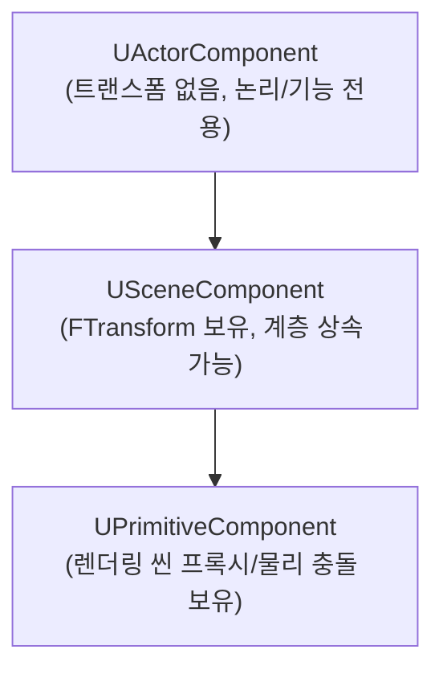
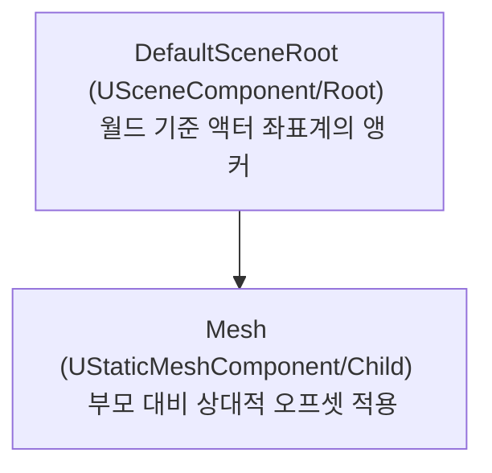

[◀ UE5 C++ 개발 대시보드로 돌아가기](./UE5.md)

# Unreal Engine 컴포넌트(Components) 구조 및 내부 메커니즘

이 문서는 Unreal Engine의 액터(Actor)와 컴포넌트(Component) 간의 아키텍처 관계, 컴포넌트 분류, 메모리 수명 주기, 어태치먼트(Attachment) 시스템, 그리고 성능 최적화 베스트 프랙티스를 설명합니다.

---

## 1. 액터(Actor)와 컴포넌트(Component)의 기본 관계

언리얼 엔진에서 `AActor`는 월드 내에 배치 가능한 물리적 최소 단위이지만, 그 자체로는 기하학적 형태나 공간 트랜스폼(위치, 회전, 스케일)을 직접 소유하지 않는 일종의 **컴포넌트 컨테이너**입니다.

- **`AActor::RootComponent`:** 액터의 대표 트랜스폼 정보를 담당하는 `USceneComponent` 유형의 포인터입니다. 액터의 위치 값을 변경하는 `SetActorLocation()` 등은 내부적으로 이 `RootComponent`를 경유하여 동작합니다. 이 포인터가 `nullptr`인 액터는 월드 공간 내에 기하학적인 실체가 존재하지 않는 논리적 객체로만 취급됩니다.
- **컴포넌트 컨테이너 구조:** 액터는 내부에 `TArray<UActorComponent*> OwnedComponents` 배열을 보유하여 액터에 소속된 모든 컴포넌트 인스턴스들의 참조 관계를 보유하며, 이를 바탕으로 컴포넌트들의 가비지 컬렉션(GC) 및 생명 주기를 총괄합니다.

---

## 2. 컴포넌트의 세부 계층 구조

컴포넌트는 처리 영역과 렌더링/물리 리소스 점유 상태에 따라 세 단계의 기본 클래스로 상속 계층이 세분화되어 있습니다.



### ① UActorComponent
- **공간 정보(Transform)가 존재하지 않는** 최상위 기본 컴포넌트입니다.
- 가비지 컬렉션(GC), 틱(Tick) 주기, 네트워크 리플렉션(Replication) 기능을 가지며, 트랜스폼 상속이 불필요한 논리적 상태나 보조 연산 로직에 주로 사용됩니다.
- *주요 예시:*
  - `UMovementComponent` 및 서브클래스들 (이동 처리 제어)
  - `UAIPerceptionComponent` (AI 감지 센서 로직)

### ② USceneComponent
- `UActorComponent`를 상속하며, 실제 3D 월드 상에서의 물리 공간 정보인 **`FTransform`**을 보유합니다.
- 부모-자식 컴포넌트 간에 어태치먼트(Attachment) 관계를 수립하여, 로컬 좌표계를 상속받는 공간적 하이러키 구조를 빌드하는 시발점입니다.
- *주요 예시:*
  - `USpringArmComponent` (카메라 거리 및 충돌 완충)
  - `UCameraComponent` (뷰포트 시점 렌더링 카메라)

### ③ UPrimitiveComponent
- `USceneComponent`를 상속하며, 실질적인 기하학적 형상 정보(Geometry), 시각적 렌더링 인터페이스(Mesh), 그리고 물리 연산에 활용되는 **충돌체(Collision)** 스펙을 보유합니다.
- 엔진 내부의 **렌더 씬(`FScene`)** 및 **물리 씬(`FPhysScene`)**에 직접 등록(Register)되어 실제 드로우 콜을 유발하고, 피직스 엔진의 충돌 감지 및 물리 반응에 직접 대응합니다.
- *주요 예시:*
  - `UStaticMeshComponent` (정적 메시)
  - `USkeletalMeshComponent` (본 애니메이션을 포함한 스켈레탈 메시)
  - `UBoxComponent` / `USphereComponent` / `UCapsuleComponent` (단순 기하학 충돌체)

---

## 3. C++ 생성 컴포넌트 vs 런타임 동적 생성 컴포넌트

컴포넌트를 생성 및 정의하는 방식에 따라 물리 엔진 등록 프로세스 및 수정 가능성이 결정됩니다.

### ① C++ 생성자 기반 컴포넌트 (`CreateDefaultSubobject`)
- **생성 시점:** 액터 C++ 클래스의 생성자 함수(`AMyActor::AMyActor()`) 내에서만 실행됩니다.
- **내부 동작:**
  - 액터의 **디폴트 서브오브젝트(Default Subobject)**로 강제 등록되며, 클래스의 기본 형틀인 **CDO(Class Default Object)** 메모리에 템플릿 형태로 인스턴스화됩니다.
- **주요 특징:**
  - 블루프린트 디테일 패널에 고정 노출되어 프로퍼티를 자유롭게 덮어쓸 수 있습니다.
  - C++ 코드 설계 규칙에 원천적으로 묶여 있어, 블루프린트 에디터에서 해당 컴포넌트를 직접 삭제하거나 부모-자식 계층 구조에서 분리할 수 없습니다.

### ② 런타임 동적 컴포넌트 (`NewObject` & `RegisterComponent`)
- **생성 시점:** 플레이 진행 중(예: `BeginPlay` 이후 특정 트리거 이벤트 시점) 동적으로 월드에 인스턴스화할 때 실행됩니다.
- **내부 동작:**
  1. `NewObject<TComponentClass>(this)`를 통하여 가비지 컬렉션의 감시를 받는 인스턴스 메모리를 동적 할당합니다.
  2. 반드시 **`RegisterComponent()`** 함수를 명시적으로 호출해야 합니다. 이 작업이 생략되면 컴포넌트의 가시적 렌더링 데이터(`FPrimitiveSceneProxy`) 및 물리 충돌체가 렌더러와 피직스 솔버 씬에 등재되지 않아 연산 대상에서 누락됩니다.
- **주요 특징:**
  - CDO 메모리에 사전 적재되지 않으므로 에디터 내 배치 편집이 불가하겠지만, 필요에 따라 유연하게 런타임 생성을 지원하므로 적재 메모리를 최적화할 때 용이합니다.

---

## 4. 어태치먼트(Attachment) 시스템의 내부 구조

어태치먼트는 두 개의 `USceneComponent` 객체 간에 부모-자식 기하 구조를 연결하여 부모의 트랜스폼 변화를 자식에게 상속시키는 핵심 서브시스템입니다.

### C++ 생성자에서의 부착 (`SetupAttachment`)
- 생성자 함수 안에서 컴포넌트 인스턴스의 하이러키 레이아웃 템플릿(CDO)을 고정 수립할 때 사용됩니다.
- 이 단계는 물리/렌더 씬이 완전히 구동되기 전이므로 순수 구조적 참조 설정만 작동하며 런타임 부하가 발생하지 않습니다.

### 런타임에서의 동적 부착 (`AttachToComponent`)
- 런타임 도중 탈착(Detach) 혹은 무기 장착과 같은 뼈대(Socket) 연결 작업 시 사용됩니다.
- `FAttachmentTransformRules` 구조체를 파라미터로 제공하여, 부착 시 자식의 트랜스폼 상태를 부모의 로컬 기준으로 리셋할 것인지(KeepRelative), 현재 월드 공간의 좌표를 강제 유지시킬 것인지(KeepWorld) 선택해야 합니다.

### 내부 정보 관리 및 계산 흐름
`USceneComponent`는 부착 구조 조율을 위해 내부에 구조적 멤버 변수를 관리합니다.
```cpp
USceneComponent* AttachParent;             // 부모 컴포넌트 포인터
TArray<USceneComponent*> AttachChildren;   // 자식 컴포넌트 포인터 배열
FName AttachSocketName;                    // 소켓(Bone) 공간에 부착되었을 때의 소켓 식별자
```

- **월드 트랜스폼 갱신:**
  - 자식 컴포넌트는 실제 연산에서 로컬 변환값(`RelativeLocation`, `RelativeRotation`, `RelativeScale3D`) 정보만 보관합니다.
  - 자식 컴포넌트의 월드 좌표 조회가 필요하거나 트랜스폼 변경 이벤트(`UpdateComponentToWorld`)가 트리거되면 아래의 매트릭스 변환 과정을 따릅니다.
    $$\text{WorldTransform}_{\text{Child}} = \text{RelativeTransform}_{\text{Child}} \times \text{WorldTransform}_{\text{Parent}}$$
  - 부모에 물리 엔진 제어가 수반되는 경우(Ragdoll 등), 매 프레임 피직스 씬 측과 C++ 트랜스폼 필드 사이에서 강제 좌표 동기화 연산이 발생합니다.

---

## 5. 컴포넌트 라이프사이클(Lifecycle) 주요 가상 함수

컴포넌트가 활성화되고 종료되는 단계에서 내부적으로 실행되는 핵심 흐름 인터페이스입니다.

1. **`InitializeComponent()` / `UninitializeComponent()`**
   - `bWantsInitializeComponent = true` 옵션이 설정되어 있는 경우에 한하여, 액터가 스폰되거나 컴포넌트가 월드에 구성 완료되었을 때 초기의 데이터 바인딩이나 무거운 상태 적재 초기화를 전담하는 콜백 영역입니다.
2. **`BeginPlay()` / `EndPlay()`**
   - 컴포넌트가 게임 월드 시뮬레이션 내에 실질적으로 참여(물리/렌더링 등록 활성화)하여 플레이 루프에 돌입하는 최초 시작 시점과 종료 및 자원 정리 시점입니다.
3. **`TickComponent()`**
   - 매 프레임 컴포넌트 고유 로직을 업데이트하는 틱 사이클 루프입니다.
   - **성능 팁:** 업데이트할 프레임 로직이 불필요하다면 반드시 `PrimaryComponentTick.bCanEverTick = false;`를 설정하여 틱 루프 큐에서 제외시켜야 CPU 스레드 오버헤드를 막을 수 있습니다.
4. **`DestroyComponent()`**
   - 컴포넌트의 해제 및 파괴를 선언하는 함수입니다. 호출 시 해당 컴포넌트는 즉각 렌더/물리 씬에서 제외(`UnregisterComponent`)되고, 소유한 액터의 하이러키 계층에서 박탈되어 가비지 컬렉터의 수집 큐로 넘겨집니다.

---

## 6. 액터 컴포넌트 계층 구조(Hierarchy)와 실무적 연관 관계

액터 내부의 `USceneComponent`들은 무조건 단일 루트(`RootComponent`)를 정점으로 하는 트리(Tree)형 계층 구조를 형성합니다. 이 계층 구조가 물리 동작 및 기하 변환에 미치는 구체적인 연관 관계는 다음과 같습니다.

### ① DefaultSceneRoot와 Mesh의 하이러키 관계
에디터 상에서 빈 액터를 배치하면, 트랜스폼 정보만 존재하는 가상의 앵커 포인트인 `DefaultSceneRoot` 컴포넌트가 자동으로 루트로 할당됩니다. 여기에 시각적인 `MeshComponent`를 자식으로 드롭하여 계층 구조를 형성하게 되면 아래와 같은 트랜스폼 상속 관계가 수립됩니다.



- **상속 흐름:** 부모인 `DefaultSceneRoot`가 움직이거나 회전하면, 자식인 `Mesh`는 부모의 변환 행렬값을 누적 전달받아 월드 공간 상에서 동등한 궤적으로 같이 움직입니다.
- **개별 오프셋 조정:** 자식인 `Mesh`를 선택하여 자체 위치를 조절(예: 발바닥 높이를 맞추기 위한 Z축 이동 등)하면, 자식의 `RelativeLocation` 필드만 변경될 뿐 앵커 역할을 하는 부모의 실제 월드 루트 좌표값(`DefaultSceneRoot`의 World Location)에는 아무런 영향을 주지 않습니다.
- **루트 대체(Promote) 동작:** `DefaultSceneRoot` 하위의 자식 `Mesh`를 드래그하여 부모인 `DefaultSceneRoot` 위로 덮어씌우면, `Mesh` 컴포넌트가 새로운 `RootComponent`로 대체 임명(Promote)되고 임시 컴포넌트였던 `DefaultSceneRoot`는 가비지 컬렉터에 의해 자동으로 파괴 제거됩니다.

### ② 모빌리티(Mobility)의 하향 상속 규칙
부모 컴포넌트의 `Mobility` 설정은 자식 컴포넌트의 움직임 유효 한계를 절대적으로 지배합니다.
- **부모가 Static인 경우:** 부모의 트랜스폼이 고정되어 있으므로, 하위 자식 컴포넌트들의 `Mobility`가 `Movable`로 설정되어 있더라도 런타임에 부모를 따라 이동할 수 없으며, 물리적인 움직임에 제약이 발생합니다.
- **부모가 Movable인 경우:** 자식 컴포넌트는 개별적으로 `Static` 혹은 `Movable` 모빌리티를 선택하여 상속 관계에 맞춰 개별 거동할 수 있습니다.

### ③ 소켓(Socket)을 경유한 컴포넌트 연결 구조
스켈레탈 메시 컴포넌트(`USkeletalMeshComponent`)나 특정 소켓 장착점을 제공하는 컴포넌트를 부모로 둘 경우, 자식 컴포넌트를 일반 부모의 트랜스폼 원점이 아닌 특정 애니메이션 본(Bone)의 궤적에 종속시킬 수 있습니다.
```cpp
// C++ 소켓 부착 예시
WeaponMesh->SetupAttachment(CharacterMesh, TEXT("Hand_R_Socket"));
```
이 상태가 수립되면 자식 컴포넌트의 월드 트랜스폼 계산 수식은 다음과 같이 변환되어 매 틱 애니메이션 본의 움직임과 완벽하게 동기화됩니다.
$$\text{WorldTransform}_{\text{Weapon}} = \text{RelativeTransform}_{\text{Weapon}} \times \text{WorldTransform}_{\text{RightHandSocket}}$$

---

## 7. 컴포넌트 C++ 생성 및 바인딩 API

### ① CreateDefaultSubobject
액터(Actor) 또는 UObject의 C++ 생성자(Constructor) 단계에서 하위 컴포넌트(Subobject)를 인스턴스화하고 이를 클래스 기본 객체(CDO)의 멤버 템플릿으로 등록하는 데 사용하는 템플릿 팩토리 함수입니다.

- **핵심 목적:** C++ 단에서 컴포넌트의 디폴트 템플릿 메모리 스펙을 사전 정의하고 리플렉션에 올려 에디터 제어를 활성화함.
- **파라미터 상세:**
  - `TReturnType`: 생성할 컴포넌트 클래스 타입 (예: `<UStaticMeshComponent>`).
  - `SubobjectName` (`FName`): 액터 범위 내에서 중복되지 않아야 하는 고유 이름 식별자.
- **기술적 팁 (Technical Tips):** 반드시 **생성자 내부**에서만 호출되어야 하며, `BeginPlay()` 등 런타임 단계에 호출 시 즉각 크래시가 발생합니다. 런타임 생성 시에는 `NewObject<T>()` 및 `RegisterComponent()`를 순차 활용해야 합니다.

### ② SetupAttachment()
액터 C++ 생성자 단계에서 `USceneComponent` 간의 계층 상속 관계를 기하학적으로 영구 부착 및 설정하는 빌드 함수입니다.

- **핵심 목적:** 생성자에서 메모리 스폰 완료된 컴포넌트들의 트리형 계층 구조(Hierarchy) 및 소켓 연결을 수립함.
- **파라미터 상세:**
  - `InParent` (`USceneComponent*`): 부착 대상이 될 부모 컴포넌트 포인터.
  - `InSocketName` (`FName`, 선택): 부착할 부모의 본(Bone) 또는 소켓 명칭.
- **기술적 팁 (Technical Tips):** 이 함수 역시 **생성자 전용**입니다. 게임 도중(런타임) 컴포넌트 부착 상태를 조작할 때는 반드시 `AttachToComponent()` 또는 `DetachFromComponent()`를 호출해야 정상적으로 물리/렌더링 씬 변환 행렬 업데이트가 트리거됩니다. 런타임에 이 함수를 사용하면 컴포넌트 위치가 원점에 영구 동결되는 심각한 오작동이 유발됩니다.

---

### C++ 구현 예제 코드
```cpp
// AMyActor.cpp (생성자 예제)
AMyActor::AMyActor()
{
    // 1. 디폴트 서브오브젝트 생성
    CustomRoot = CreateDefaultSubobject<USceneComponent>(TEXT("CustomRootComponent"));
    RootComponent = CustomRoot;

    VisualMesh = CreateDefaultSubobject<UStaticMeshComponent>(TEXT("VisualMeshComponent"));
    
    // 2. 부모-자식 계층 구조 수립
    VisualMesh->SetupAttachment(RootComponent);
}
```


