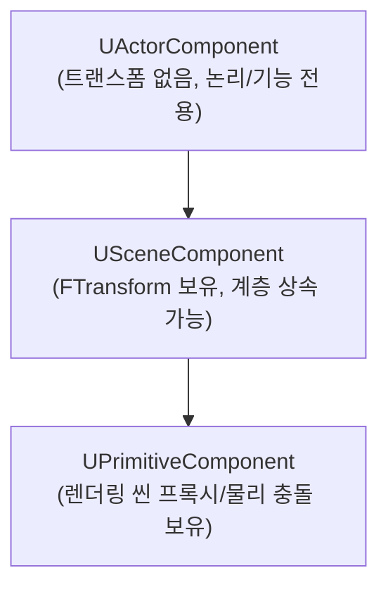
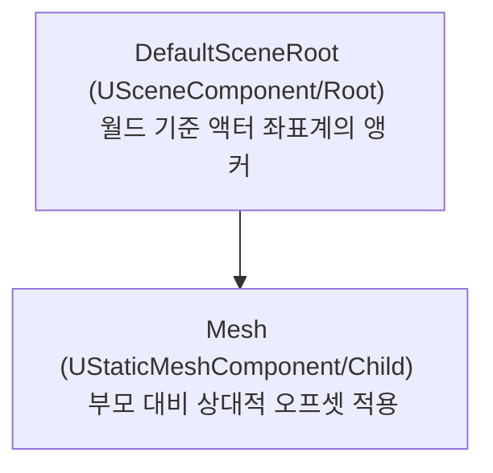

[◀ UE5 C++ 개발 대시보드로 돌아가기](./UE5.md)

# Unreal Engine 컴포넌트(Components) 구조 및 내부 메커니즘

이 문서는 Unreal Engine의 액터(Actor)와 컴포넌트(Component) 간의 아키텍처 관계, 컴포넌트 분류, 메모리 수명 주기, 어태치먼트(Attachment) 시스템, 그리고 성능 최적화 베스트 프랙티스를 설명합니다.

---

## 1. 액터(Actor)와 컴포넌트(Component)의 기본 관계

언리얼 엔진에서 `AActor`는 월드 내에 배치 가능한 물리적 최소 단위이지만, 그 자체로는 기하학적 형태나 공간 트랜스폼(위치, 회전, 스케일)을 직접 소유하지 않는 일종의 **컴포넌트 컨테이너**입니다.

- **`AActor::RootComponent`:** 액터의 대표 트랜스폼 정보를 담당하는 `USceneComponent` 유형의 포인터입니다. 액터의 위치 값을 변경하는 `SetActorLocation()` 등은 내부적으로 이 `RootComponent`를 경유하여 동작합니다. 이 포인터가 `nullptr`인 액터는 월드 공간 내에 기하학적인 실체가 존재하지 않는 논리적 객체로만 취급됩니다.
- **컴포넌트 컨테이너 구조:** 액터는 내부에 `TArray<UActorComponent*> OwnedComponents` 배열을 보유하여 액터에 소속된 모든 컴포넌트 인스턴스들의 참조 관계를 보유하며, 이를 바탕으로 컴포넌트들의 가비지 컬렉션(GC) 및 생명 주기를 총괄합니다.

---

## 2. 컴포넌트의 세부 계층 구조

컴포넌트는 처리 영역과 렌더링/물리 리소스 점유 상태에 따라 세 단계의 기본 클래스로 상속 계층이 세분화되어 있습니다.


```mermaid
graph TD
    UActorComponent["UActorComponent<br>(트랜스폼 없음, 논리/기능 전용)"] --> USceneComponent["USceneComponent<br>(FTransform 보유, 계층 상속 가능)"]
    USceneComponent --> UPrimitiveComponent["UPrimitiveComponent<br>(렌더링 씬 프록시/물리 충돌 보유)"]
```

### ① UActorComponent
- **공간 정보(Transform)가 존재하지 않는** 최상위 기본 컴포넌트입니다.
- 가비지 컬렉션(GC), 틱(Tick) 주기, 네트워크 리플렉션(Replication) 기능을 가지며, 트랜스폼 상속이 불필요한 논리적 상태나 보조 연산 로직에 주로 사용됩니다.
- *주요 예시:*
  - `UMovementComponent` 및 서브클래스들 (이동 처리 제어)
  - `UAIPerceptionComponent` (AI 감지 센서 로직)

### ② USceneComponent
- `UActorComponent`를 상속하며, 실제 3D 월드 상에서의 물리 공간 정보인 **`FTransform`**을 보유합니다.
- 부모-자식 컴포넌트 간에 어태치먼트(Attachment) 관계를 수립하여, 로컬 좌표계를 상속받는 공간적 하이러키 구조를 빌드하는 시발점입니다.
- *주요 예시:*
  - `USpringArmComponent` (카메라 거리 및 충돌 완충)
  - `UCameraComponent` (뷰포트 시점 렌더링 카메라)

### ③ UPrimitiveComponent
- `USceneComponent`를 상속하며, 실질적인 기하학적 형상 정보(Geometry), 시각적 렌더링 인터페이스(Mesh), 그리고 물리 연산에 활용되는 **충돌체(Collision)** 스펙을 보유합니다.
- 엔진 내부의 **렌더 씬(`FScene`)** 및 **물리 씬(`FPhysScene`)**에 직접 등록(Register)되어 실제 드로우 콜을 유발하고, 피직스 엔진의 충돌 감지 및 물리 반응에 직접 대응합니다.
- *주요 예시:*
  - `UStaticMeshComponent` (정적 메시)
  - `USkeletalMeshComponent` (본 애니메이션을 포함한 스켈레탈 메시)
  - `UBoxComponent` / `USphereComponent` / `UCapsuleComponent` (단순 기하학 충돌체)

---

## 3. C++ 생성 컴포넌트 vs 런타임 동적 생성 컴포넌트

컴포넌트를 생성 및 정의하는 방식에 따라 물리 엔진 등록 프로세스 및 수정 가능성이 결정됩니다.

### ① C++ 생성자 기반 컴포넌트 (`CreateDefaultSubobject`)
- **생성 시점:** 액터 C++ 클래스의 생성자 함수(`AMyActor::AMyActor()`) 내에서만 실행됩니다.
- **내부 동작:**
  - 액터의 **디폴트 서브오브젝트(Default Subobject)**로 강제 등록되며, 클래스의 기본 형틀인 **CDO(Class Default Object)** 메모리에 템플릿 형태로 인스턴스화됩니다.
- **주요 특징:**
  - 블루프린트 디테일 패널에 고정 노출되어 프로퍼티를 자유롭게 덮어쓸 수 있습니다.
  - C++ 코드 설계 규칙에 원천적으로 묶여 있어, 블루프린트 에디터에서 해당 컴포넌트를 직접 삭제하거나 부모-자식 계층 구조에서 분리할 수 없습니다.

### ② 런타임 동적 컴포넌트 (`NewObject` & `RegisterComponent`)
- **생성 시점:** 플레이 진행 중(예: `BeginPlay` 이후 특정 트리거 이벤트 시점) 동적으로 월드에 인스턴스화할 때 실행됩니다.
- **내부 동작:**
  1. `NewObject<TComponentClass>(this)`를 통하여 가비지 컬렉션의 감시를 받는 인스턴스 메모리를 동적 할당합니다.
  2. 반드시 **`RegisterComponent()`** 함수를 명시적으로 호출해야 합니다. 이 작업이 생략되면 컴포넌트의 가시적 렌더링 데이터(`FPrimitiveSceneProxy`) 및 물리 충돌체가 렌더러와 피직스 솔버 씬에 등재되지 않아 연산 대상에서 누락됩니다.
- **주요 특징:**
  - CDO 메모리에 사전 적재되지 않으므로 에디터 내 배치 편집이 불가하겠지만, 필요에 따라 유연하게 런타임 생성을 지원하므로 적재 메모리를 최적화할 때 용이합니다.

---

## 4. 어태치먼트(Attachment) 시스템의 내부 구조

어태치먼트는 두 개의 `USceneComponent` 객체 간에 부모-자식 기하 구조를 연결하여 부모의 트랜스폼 변화를 자식에게 상속시키는 핵심 서브시스템입니다.

### C++ 생성자에서의 부착 (`SetupAttachment`)
- 생성자 함수 안에서 컴포넌트 인스턴스의 하이러키 레이아웃 템플릿(CDO)을 고정 수립할 때 사용됩니다.
- 이 단계는 물리/렌더 씬이 완전히 구동되기 전이므로 순수 구조적 참조 설정만 작동하며 런타임 부하가 발생하지 않습니다.

### 런타임에서의 동적 부착 (`AttachToComponent`)
- 런타임 도중 탈착(Detach) 혹은 무기 장착과 같은 뼈대(Socket) 연결 작업 시 사용됩니다.
- `FAttachmentTransformRules` 구조체를 파라미터로 제공하여, 부착 시 자식의 트랜스폼 상태를 부모의 로컬 기준으로 리셋할 것인지(KeepRelative), 현재 월드 공간의 좌표를 강제 유지시킬 것인지(KeepWorld) 선택해야 합니다.

### 내부 정보 관리 및 계산 흐름
`USceneComponent`는 부착 구조 조율을 위해 내부에 구조적 멤버 변수를 관리합니다.
```cpp
USceneComponent* AttachParent;             // 부모 컴포넌트 포인터
TArray<USceneComponent*> AttachChildren;   // 자식 컴포넌트 포인터 배열
FName AttachSocketName;                    // 소켓(Bone) 공간에 부착되었을 때의 소켓 식별자
```

- **월드 트랜스폼 갱신:**
  - 자식 컴포넌트는 실제 연산에서 로컬 변환값(`RelativeLocation`, `RelativeRotation`, `RelativeScale3D`) 정보만 보관합니다.
  - 자식 컴포넌트의 월드 좌표 조회가 필요하거나 트랜스폼 변경 이벤트(`UpdateComponentToWorld`)가 트리거되면 아래의 매트릭스 변환 과정을 따릅니다.
    $$\text{WorldTransform}_{\text{Child}} = \text{RelativeTransform}_{\text{Child}} \times \text{WorldTransform}_{\text{Parent}}$$
  - 부모에 물리 엔진 제어가 수반되는 경우(Ragdoll 등), 매 프레임 피직스 씬 측과 C++ 트랜스폼 필드 사이에서 강제 좌표 동기화 연산이 발생합니다.

---

## 5. 컴포넌트 라이프사이클(Lifecycle) 주요 가상 함수

컴포넌트가 활성화되고 종료되는 단계에서 내부적으로 실행되는 핵심 흐름 인터페이스입니다.

1. **`InitializeComponent()` / `UninitializeComponent()`**
   - `bWantsInitializeComponent = true` 옵션이 설정되어 있는 경우에 한하여, 액터가 스폰되거나 컴포넌트가 월드에 구성 완료되었을 때 초기의 데이터 바인딩이나 무거운 상태 적재 초기화를 전담하는 콜백 영역입니다.
2. **`BeginPlay()` / `EndPlay()`**
   - 컴포넌트가 게임 월드 시뮬레이션 내에 실질적으로 참여(물리/렌더링 등록 활성화)하여 플레이 루프에 돌입하는 최초 시작 시점과 종료 및 자원 정리 시점입니다.
3. **`TickComponent()`**
   - 매 프레임 컴포넌트 고유 로직을 업데이트하는 틱 사이클 루프입니다.
   - **성능 팁:** 업데이트할 프레임 로직이 불필요하다면 반드시 `PrimaryComponentTick.bCanEverTick = false;`를 설정하여 틱 루프 큐에서 제외시켜야 CPU 스레드 오버헤드를 막을 수 있습니다.
4. **`DestroyComponent()`**
   - 컴포넌트의 해제 및 파괴를 선언하는 함수입니다. 호출 시 해당 컴포넌트는 즉각 렌더/물리 씬에서 제외(`UnregisterComponent`)되고, 소유한 액터의 하이러키 계층에서 박탈되어 가비지 컬렉터의 수집 큐로 넘겨집니다.

---

## 6. 액터 컴포넌트 계층 구조(Hierarchy)와 실무적 연관 관계

액터 내부의 `USceneComponent`들은 무조건 단일 루트(`RootComponent`)를 정점으로 하는 트리(Tree)형 계층 구조를 형성합니다. 이 계층 구조가 물리 동작 및 기하 변환에 미치는 구체적인 연관 관계는 다음과 같습니다.

### ① DefaultSceneRoot와 Mesh의 하이러키 관계
에디터 상에서 빈 액터를 배치하면, 트랜스폼 정보만 존재하는 가상의 앵커 포인트인 `DefaultSceneRoot` 컴포넌트가 자동으로 루트로 할당됩니다. 여기에 시각적인 `MeshComponent`를 자식으로 드롭하여 계층 구조를 형성하게 되면 아래와 같은 트랜스폼 상속 관계가 수립됩니다.


```mermaid
graph TD
    Root["DefaultSceneRoot (USceneComponent/Root) <br> 월드 기준 액터 좌표계의 앵커"] --> Mesh["Mesh (UStaticMeshComponent/Child) <br> 부모 대비 상대적 오프셋 적용"]
```

- **상속 흐름:** 부모인 `DefaultSceneRoot`가 움직이거나 회전하면, 자식인 `Mesh`는 부모의 변환 행렬값을 누적 전달받아 월드 공간 상에서 동등한 궤적으로 같이 움직입니다.
- **개별 오프셋 조정:** 자식인 `Mesh`를 선택하여 자체 위치를 조절(예: 발바닥 높이를 맞추기 위한 Z축 이동 등)하면, 자식의 `RelativeLocation` 필드만 변경될 뿐 앵커 역할을 하는 부모의 실제 월드 루트 좌표값(`DefaultSceneRoot`의 World Location)에는 아무런 영향을 주지 않습니다.
- **루트 대체(Promote) 동작:** `DefaultSceneRoot` 하위의 자식 `Mesh`를 드래그하여 부모인 `DefaultSceneRoot` 위로 덮어씌우면, `Mesh` 컴포넌트가 새로운 `RootComponent`로 대체 임명(Promote)되고 임시 컴포넌트였던 `DefaultSceneRoot`는 가비지 컬렉터에 의해 자동으로 파괴 제거됩니다.

### ② 모빌리티(Mobility)의 하향 상속 규칙
부모 컴포넌트의 `Mobility` 설정은 자식 컴포넌트의 움직임 유효 한계를 절대적으로 지배합니다.
- **부모가 Static인 경우:** 부모의 트랜스폼이 고정되어 있으므로, 하위 자식 컴포넌트들의 `Mobility`가 `Movable`로 설정되어 있더라도 런타임에 부모를 따라 이동할 수 없으며, 물리적인 움직임에 제약이 발생합니다.
- **부모가 Movable인 경우:** 자식 컴포넌트는 개별적으로 `Static` 혹은 `Movable` 모빌리티를 선택하여 상속 관계에 맞춰 개별 거동할 수 있습니다.

### ③ 소켓(Socket)을 경유한 컴포넌트 연결 구조
스켈레탈 메시 컴포넌트(`USkeletalMeshComponent`)나 특정 소켓 장착점을 제공하는 컴포넌트를 부모로 둘 경우, 자식 컴포넌트를 일반 부모의 트랜스폼 원점이 아닌 특정 애니메이션 본(Bone)의 궤적에 종속시킬 수 있습니다.
```cpp
// C++ 소켓 부착 예시
WeaponMesh->SetupAttachment(CharacterMesh, TEXT("Hand_R_Socket"));
```
이 상태가 수립되면 자식 컴포넌트의 월드 트랜스폼 계산 수식은 다음과 같이 변환되어 매 틱 애니메이션 본의 움직임과 완벽하게 동기화됩니다.
$$\text{WorldTransform}_{\text{Weapon}} = \text{RelativeTransform}_{\text{Weapon}} \times \text{WorldTransform}_{\text{RightHandSocket}}$$

---

## 7. 컴포넌트 C++ 생성 및 바인딩 API

### ① CreateDefaultSubobject
액터(Actor) 또는 UObject의 C++ 생성자(Constructor) 단계에서 하위 컴포넌트(Subobject)를 인스턴스화하고 이를 클래스 기본 객체(CDO)의 멤버 템플릿으로 등록하는 데 사용하는 템플릿 팩토리 함수입니다.

- **핵심 목적:** C++ 단에서 컴포넌트의 디폴트 템플릿 메모리 스펙을 사전 정의하고 리플렉션에 올려 에디터 제어를 활성화함.
- **파라미터 상세:**
  - `TReturnType`: 생성할 컴포넌트 클래스 타입 (예: `<UStaticMeshComponent>`).
  - `SubobjectName` (`FName`): 액터 범위 내에서 중복되지 않아야 하는 고유 이름 식별자.
- **기술적 팁 (Technical Tips):** 반드시 **생성자 내부**에서만 호출되어야 하며, `BeginPlay()` 등 런타임 단계에 호출 시 즉각 크래시가 발생합니다. 런타임 생성 시에는 `NewObject<T>()` 및 `RegisterComponent()`를 순차 활용해야 합니다.

### ② SetupAttachment()
액터 C++ 생성자 단계에서 `USceneComponent` 간의 계층 상속 관계를 기하학적으로 영구 부착 및 설정하는 빌드 함수입니다.

- **핵심 목적:** 생성자에서 메모리 스폰 완료된 컴포넌트들의 트리형 계층 구조(Hierarchy) 및 소켓 연결을 수립함.
- **파라미터 상세:**
  - `InParent` (`USceneComponent*`): 부착 대상이 될 부모 컴포넌트 포인터.
  - `InSocketName` (`FName`, 선택): 부착할 부모의 본(Bone) 또는 소켓 명칭.
- **기술적 팁 (Technical Tips):** 이 함수 역시 **생성자 전용**입니다. 게임 도중(런타임) 컴포넌트 부착 상태를 조작할 때는 반드시 `AttachToComponent()` 또는 `DetachFromComponent()`를 호출해야 정상적으로 물리/렌더링 씬 변환 행렬 업데이트가 트리거됩니다. 런타임에 이 함수를 사용하면 컴포넌트 위치가 원점에 영구 동결되는 심각한 오작동이 유발됩니다.

---

### C++ 구현 예제 코드
```cpp
// AMyActor.cpp (생성자 예제)
AMyActor::AMyActor()
{
    // 1. 디폴트 서브오브젝트 생성
    CustomRoot = CreateDefaultSubobject<USceneComponent>(TEXT("CustomRootComponent"));
    RootComponent = CustomRoot;

    VisualMesh = CreateDefaultSubobject<UStaticMeshComponent>(TEXT("VisualMeshComponent"));
    
    // 2. 부모-자식 계층 구조 수립
    VisualMesh->SetupAttachment(RootComponent);
}
```


## 8. CreateDefaultSubobject API 상세 분석

### [CreateDefaultSubobject]
- **핵심 목적:** 액터(Actor) 또는 UObject의 C++ 생성자(Constructor) 단계에서 하위 컴포넌트(Subobject)를 인스턴스화하고 이를 클래스 기본 객체(CDO, Class Default Object)의 멤버 템플릿으로 등록하는 팩토리 함수입니다.
- **파라미터 상세:**
  - `FName SubobjectName`: 액터 내에서 고유해야 하는 컴포넌트의 이름 식별자입니다. 에디터 디테일 패널 및 리플렉션 시스템에서 이 컴포넌트를 구별하는 키로 사용됩니다.
  - `bool bTransient`: (선택적 파라미터) 컴포넌트를 휘발성(Transient)으로 지정하여 세이브/로드 시 시리얼라이즈 대상에서 제외할지 결정합니다.
- **반환 값:**
  - `TReturnType*`: 생성된 컴포넌트 인스턴스의 템플릿 타입 포인터를 반환합니다.
- **기술적 팁 (Technical Tips):**
  - **생성자 내부 전용:** 이 함수는 반드시 클래스 생성자(Constructor) 블록 내부에서만 호출해야 합니다. `BeginPlay()`나 `Tick()`과 같은 런타임 수명 주기 도중에 호출하면 엔진 내부에서 즉각 어설션 오류(Assertion Fail) 및 크래시를 유발합니다. 런타임에 동적으로 컴포넌트를 생성해야 할 경우에는 `NewObject<T>()`와 `RegisterComponent()`를 조합하여 구현해야 합니다.
  - **이름 고유성:** 동일한 액터 내에서 중복된 `SubobjectName`을 사용하면 런타임 초기화 단계에서 에러가 발생하거나 널 포인터가 할당되는 치명적인 문제가 발생하므로 이름 정의 시 고유성이 엄격히 보장되어야 합니다.
- **코드 예시:**
  ```cpp
  // MyActor.h
  #pragma once
  #include "CoreMinimal.h"
  #include "GameFramework/Actor.h"
  #include "MyActor.generated.h"

  UCLASS()
  class MYPROJECT_API AMyActor : public AActor
  { 
      GENERATED_BODY()
  public:
      AMyActor();

  protected:
      UPROPERTY(VisibleAnywhere, BlueprintReadOnly, Category = "Components")
      class USceneComponent* DefaultRoot;

      UPROPERTY(VisibleAnywhere, BlueprintReadOnly, Category = "Components")
      class UStaticMeshComponent* MeshComponent;
  };

  // MyActor.cpp
  #include "MyActor.h"
  #include "Components/SceneComponent.h"
  #include "Components/StaticMeshComponent.h"

  AMyActor::AMyActor()
  { 
      DefaultRoot = CreateDefaultSubobject<USceneComponent>(TEXT("DefaultRootComponent"));
      RootComponent = DefaultRoot;

      MeshComponent = CreateDefaultSubobject<UStaticMeshComponent>(TEXT("StaticMeshComponent"));
      MeshComponent->SetupAttachment(RootComponent);
  }
  ```


## 9. 언리얼 에디터 콜리젼(Collision) 설정 및 필터링

### [Collision Presets (콜리젼 프리셋)]
- **핵심 목적:** 복잡한 충돌 반응 테이블 설정을 템플릿화하여, 에디터 상에서 여러 컴포넌트에 동일한 물리 규칙을 쉽고 일관되게 적용할 수 있게 해주는 기능입니다.
- **설정 및 구성 세부:**
  - **Collision Enabled (콜리젼 활성화 옵션):** 
    - `No Collision`: 충돌 및 쿼리 모두 비활성화합니다.
    - `Query Only (No Physics Collision)`: 오버랩, 스윕, 레이캐스트 감지만 활성화합니다.
    - `Physics Only (No Query Collision)`: 강체 물리 충돌 밀어내기만 활성화합니다.
    - `Collision Enabled (Query and Physics)`: 쿼리 감지 및 물리 밀어내기를 모두 활성화합니다.
  - **Object Type (오브젝트 타입):** 해당 컴포넌트의 기하학적 신원 분류를 지정합니다.
- **기술적 팁 (Technical Tips):**
  - 기본 제공 프리셋(예: `BlockAll`, `OverlapAll`, `Pawn`, `CharacterMesh` 등) 외에도 **Project Settings -> Engine -> Collision**에서 프로젝트 전용 커스텀 프리셋을 새로 생성하여 관리할 수 있습니다.
  - 에디터 상에서 프리셋을 `Custom`으로 변경하면 채널별 테이블을 개별적으로 수정(Ignore/Overlap/Block)할 수 있는 편집 상태로 전환됩니다.

### [Trace Channels vs Object Channels (트레이스 및 오브젝트 채널)]
- **핵심 목적:** 충돌 필터링 검사를 수행할 때, 광선 검사(Query) 기준선과 충돌체(Object)의 대상을 정교하게 구분하는 채널링 시스템입니다.
- **설정 및 구성 세부:**
  - **Object Channels (오브젝트 채널):** 물리 공간을 차지하는 실제 충돌체들을 성격별로 정의합니다. (기본 제공: `WorldStatic`, `WorldDynamic`, `Pawn`, `PhysicsBody`, `Vehicle`, `Destructible`)
  - **Trace Channels (트레이스 채널):** Line Trace나 Sweep 등 가상의 테스트 레이가 충돌체를 식별하는 데 사용하는 기준선입니다. (기본 제공: `Visibility`, `Camera`)
- **기술적 팁 (Technical Tips):**
  - 예를 들어 엄폐물 뒤의 플레이어를 조준할 때, 시각적으로는 보이므로 `Visibility` 채널은 통과(Ignore/Overlap)하고 카메라 뷰는 막아야 한다면, 카메라 콜리전 트레이스 채널을 `Block`으로 두고 시각 광선 검사용 트레이스 채널을 다르게 세팅해야 합니다.
  - 새로운 게임 조작(예: 투척 무기 궤적 검사 등)이 필요하면 세팅 메뉴에서 커스텀 트레이스 채널을 신설할 수 있습니다.

### [Collision Responses (충돌 반응 필터링)]
- **핵심 목적:** 컴포넌트와 특정 채널이 조우했을 때의 기하학적 억제 및 이벤트 트리거 양상을 결정합니다.
- **동작 반응 및 제어 규칙:**
  - **Ignore (무시):** 아무것도 감지하지 않고 관통하며 이벤트도 생성하지 않습니다 (CPU 연산 최소화).
  - **Overlap (겹침):** 막지 않고 관통하지만, 두 물체가 교차하기 시작하거나 완전히 떨어질 때 오버랩 이벤트(`On Component Begin/End Overlap`)를 감지해 게임 로직(아이템 습득, 포털 작동 등)을 수행합니다.
  - **Block (차단):** 물리적으로 통과하지 못하도록 차단하여 강체 물리 충돌을 처리하며, 타격 시 히트 이벤트(`On Component Hit`)를 트리거할 수 있습니다.


## 10. UPrimitiveComponent 겹침(Overlap) 이벤트 델리게이트

### [UPrimitiveComponent::OnComponentBeginOverlap]
- **핵심 목적:** 프리미티브 컴포넌트(`UPrimitiveComponent`)의 물리 겹침(Overlap) 탐지 영역 안으로 다른 충돌체가 진입하여 오버랩 상태가 성립되었을 때, 바인딩된 C++ 콜백 멤버 함수 및 블루프린트 노드를 순차적으로 호출하여 일괄 전파하는 다이내믹 멀티캐스트 델리게이트입니다.
- **파라미터 상세 (바인딩 대상 콜백 함수의 6대 매개변수 시그니처):**
  - `UPrimitiveComponent* OverlappedComponent`: 이벤트를 감지하여 발생시킨 본체 소유의 프리미티브 컴포넌트 포인터입니다.
  - `AActor* OtherActor`: 감지 구역 안으로 진입하여 오버랩 상태를 개시한 상대방 액터 객체의 포인터입니다.
  - `UPrimitiveComponent* OtherComp`: 겹침을 실질적으로 유발한 상대방 소유의 세부 피지컬 컴포넌트 주소입니다.
  - `int32 OtherBodyIndex`: 피직스 스켈레탈 애셋이나 복합 물리 폰에서 충돌을 유발한 상대방 물리 본(Bone) 혹은 강체 바디의 인덱스 식별 번호입니다.
  - `bool bFromSweep`: 텔레포트처럼 위치를 덮어씌운 것이 아니라, 프레임 이동 감지 스윕(`Sweep`) 탐지 연산에 의해 물리적으로 교차 돌파가 발생했는지 여부입니다.
  - `const FHitResult& SweepResult`: 스윕이 참(`true`)일 때의 충돌 접점 좌표 및 노멀 등 물리적인 상호 피격 데이터가 내포된 히트 결과 구조체 참조 레퍼런스입니다.
- **반환 값:**
  - 없음 (이벤트 발생 통지용).
- **기술적 팁 (Technical Tips):**
  - **UFUNCTION 데코레이터 및 시그니처 정렬:** `AddDynamic` 매크로로 등록할 콜백 타겟 C++ 멤버 함수 위에는 반드시 `UFUNCTION()` 매크로 데코레이터가 기재되어야 런타임 리플렉션 탐색 시 실패하지 않으며, 6개의 매개변수 타입 시그니처와 매핑 순서가 완벽히 일치해야 빌드 오류 및 런타임 크래시를 방지할 수 있습니다.
  - **물리 옵션 선결 조건:** 겹침 이벤트가 비즈니스 영역에서 정상 호출되려면, 충돌 컴포넌트의 콜리전 설정 상태(Collision Enabled)가 `QueryOnly` 또는 `QueryAndPhysics` 상태여야 하고, 동시에 **bGenerateOverlapEvents** 속성 플래그가 `true`로 인가되어 있어야 합니다.
- **코드 예시:**
  ```cpp
  // MyActor.h
  #pragma once
  #include "CoreMinimal.h"
  #include "GameFramework/Actor.h"
  #include "MyActor.generated.h"

  UCLASS()
  class MYPROJECT_API AMyActor : public AActor
  { 
      GENERATED_BODY()
  public:
      AMyActor();

  protected:
      UPROPERTY(VisibleAnywhere, BlueprintReadOnly, Category = "Components")
      class USphereComponent* TriggerSphere;

      // 델리게이트에 바인딩할 콜백 함수 선언 (UFUNCTION 필수)
      UFUNCTION()
      void OnOverlapBegin(UPrimitiveComponent* OverlappedComp, AActor* OtherActor, UPrimitiveComponent* OtherComp, int32 OtherBodyIndex, bool bFromSweep, const FHitResult& SweepResult);
  };

  // MyActor.cpp
  #include "MyActor.h"
  #include "Components/SphereComponent.h"

  AMyActor::AMyActor()
  { 
      TriggerSphere = CreateDefaultSubobject<USphereComponent>(TEXT("TriggerSphereComponent"));
      RootComponent = TriggerSphere;

      // 겹침 검출을 위한 필수 기하학적 물리 세팅
      TriggerSphere->SetCollisionEnabled(ECollisionEnabled::QueryOnly);
      TriggerSphere->SetCollisionResponseToAllChannels(ECR_Overlap);
      TriggerSphere->bGenerateOverlapEvents = true;

      // 다이내믹 멀티캐스트 델리게이트에 함수 바인딩
      TriggerSphere->OnComponentBeginOverlap.AddDynamic(this, &AMyActor::OnOverlapBegin);
  }

  void AMyActor::OnOverlapBegin(UPrimitiveComponent* OverlappedComp, AActor* OtherActor, UPrimitiveComponent* OtherComp, int32 OtherBodyIndex, bool bFromSweep, const FHitResult& SweepResult)
  { 
      if (OtherActor && (OtherActor != this))
      { 
          // 상대방 액터 검출 이후 동작 로직 처리
      }
  }


## 11. 스켈레탈 메쉬 획득 및 컴포넌트 소켓 부착 (Equip 시스템 구현 API)

### [ACharacter::GetMesh()]
- **핵심 목적:** `ACharacter` 클래스 내부에 사전 구성된 주 비주얼 컴포넌트인 스켈레탈 메쉬 컴포넌트(`USkeletalMeshComponent*`)의 렌더링 포인터를 반환합니다.
- **파라미터 상세:**
  - 파라미터 없음 (`void`).
- **반환 값:**
  - `USkeletalMeshComponent*`: 캐릭터 메쉬 및 애니메이션 시스템을 관장하는 컴포넌트의 포인터.
- **기술적 팁 (Technical Tips):**
  - 캐릭터의 루트 컴포넌트(`UCapsuleComponent`) 하위에 부착되어 있는 자식 컴포넌트입니다.
  - 무기나 장비(Armor, Weapon)를 캐릭터 신체 소켓에 마운트할 때 `AttachToComponent`의 `Parent` 인자로 전달되는 표준 부모 대상입니다.
  - 호출 전 `IsValid(GetMesh())` 또는 `nullptr` 유효성 검증을 거치는 것이 디버깅 관점에서 권장됩니다.
- **코드 예시:**
  ```cpp
  USkeletalMeshComponent* CharacterMesh = GetMesh();
  if (CharacterMesh)
  {
      // 메쉬 소켓 존재 여부 확인 후 장착 처리 진행
  }
  ```

### [USceneComponent::AttachToComponent()]
- **핵심 목적:** 지정한 `USceneComponent`를 타깃 컴포넌트 또는 특정 소켓(Socket)의 하위 계층 구조로 신규 귀속 부착(Attach)시킵니다.
- **파라미터 상세:**
  - `Parent` (`USceneComponent*`): 부착 타깃이 될 상위 부모 컴포넌트 주소입니다. (예: `GetMesh()`)
  - `AttachmentRules` (`const FAttachmentTransformRules&`): 위치, 회전, 스케일 변환을 부모 좌표계에 오버라이드할지 또는 이전 월드 위치를 보존할지 결정하는 규칙 구조체입니다.
  - `SocketName` (`FName`): 부모 컴포넌트 뼈대(Bone) 또는 스켈레탈 애셋에 정의된 소켓의 이름입니다. (`NAME_None` 지정 시 부모의 루트 오프셋에 부착)
- **반환 값:**
  - `bool`: 계층 구조 재배치 및 트랜스폼 갱신 부착 성공 여부.
- **기술적 팁 (Technical Tips):**
  - **사전 물리/콜리전 해제:** 아이템이 부착되기 전에 `SetSimulatePhysics(false)` 및 `SetCollisionEnabled(ECollisionEnabled::NoCollision)`가 선행 처리되어야 물리 충돌로 인한 튕김 현상을 막을 수 있습니다.
  - **소켓 명칭 일치:** 부모 메쉬 소켓 이름(`FName`)의 오타(예: `RightHandSockey` 등)가 존재하면 소켓 위치가 아닌 부모의 원점(Origin)에 부착되는 버그가 발생합니다.
- **코드 예시:**
  ```cpp
  void AWeapon::Equip(USceneComponent* InParent, FName InSocketName)
  {
      if (!InParent || !ItemMesh) return;

      // 물리 반응 및 충돌 검출 억제
      ItemMesh->SetSimulatePhysics(false);
      ItemMesh->SetCollisionEnabled(ECollisionEnabled::NoCollision);

      // 소켓 변환 정위치(Snap) 부착 규칙 선언
      FAttachmentTransformRules TransformRules(EAttachmentRule::SnapToTarget, true);
      ItemMesh->AttachToComponent(InParent, TransformRules, InSocketName);
  }
  ```

### [FAttachmentTransformRules (부착 트랜스폼 규칙)]
- **핵심 목적:** `AttachToComponent` 수행 시 부착되는 주체의 위치(Location), 회전(Rotation), 스케일(Scale) 축 값들이 부모 계층 좌표계로 이동할 때 적용될 트랜스폼 변환 정책을 정의하는 구조체입니다.
- **주요 프리셋 옵션 및 필드:**
  - `FAttachmentTransformRules::SnapToTargetNotIncludingScale`: 위치와 회전을 소켓의 피봇 좌표에 밀착(Snap)시키고, 스케일은 부착 주체의 기존 비율을 그대로 유지합니다. (무기 장착의 표준 베스트 프랙티스)
  - `FAttachmentTransformRules::KeepWorldTransform`: 현재 월드 공간상의 절대 좌표 위치와 회전값을 그대로 고정 유지하면서 계층 구조만 부모 하위로 귀속시킵니다.
  - `FAttachmentTransformRules::KeepRelativeTransform`: 기존 로컬 상대 좌표 오프셋 값을 보존합니다.
- **기술적 팁 (Technical Tips):**
  - 생성자의 두 번째 파라미터 `bWeldSimulatedBodies`를 `true`로 설정하면 강체 물리 시뮬레이션 바디가 부모 물리 바디에 일체형으로 용접(Weld)되어 단일 물리 바디처럼 동작합니다. (비물리 부착 아이템인 경우 콜리전을 끄는 것이 안전함)
- **코드 예시:**
  ```cpp
  // 무기 손 장착용 전용 FAttachmentTransformRules 선언
  FAttachmentTransformRules AttachRule(
      EAttachmentRule::SnapToTarget, // Location
      EAttachmentRule::SnapToTarget, // Rotation
      EAttachmentRule::KeepWorld,    // Scale
      true                           // bWeldSimulatedBodies
  );
  ```

  ```


## 12. 런타임 동적 콜리전 제어 API

### [UPrimitiveComponent::SetCollisionProfileName]
- **핵심 목적:** 디테일 패널에서 사전에 설정(Preset)된 특정 콜리전 프로필 명칭(예: `"NoCollision"`, `"BlockAll"`, `"Pawn"`, `"OverlapAll"` 등)을 인자로 취하여, 컴포넌트의 물리 및 쿼리 반응 필터 테이블 설정을 런타임에 동적으로 일괄 교체합니다.
- **파라미터 상세:**
  - `FName InProfileName`: 적용할 대상 콜리전 프리셋의 고유 등록 키 이름입니다.
  - `bool bUpdateOverlaps`: `true` 지정 시 프로필 변경 즉시 주변 충돌 오버랩 현황을 재점검(Update)하여 이벤트를 새로 동기화합니다.
- **반환 값:**
  - 없음 (`void`)
- **기술적 팁 (Technical Tips):**
  - **프리셋 예외 억제:** 입력한 프로필 명이 프로젝트 세팅에 정의되지 않은 오타 문자열일 경우, 아무런 런타임 크래시 없이 엔진 내부적으로 최하위 안전장치인 `NoCollision`으로 강제 대체해 적용하므로 대소문자 매핑 실수가 없도록 관리해야 합니다.
- **코드 예시:**
  ```cpp
  // 캐릭터가 죽었을 때 래그돌 상태 전환 및 캡슐 충돌 무시를 위해 프로필을 동적으로 NoCollision으로 변경
  GetCapsuleComponent()->SetCollisionProfileName(TEXT("NoCollision"));
  ```

### [UPrimitiveComponent::SetCollisionEnabled]
- **핵심 목적:** 컴포넌트의 충돌 가동 성격 수준(NoCollision, QueryOnly, PhysicsOnly, QueryAndPhysics)을 런타임 실행 중 동적으로 개별 가동/제어합니다.
- **파라미터 상세:**
  - `ECollisionEnabled::Type NewType`: 새로 대입할 활성화 동작 모드 열거형 값입니다.
- **반환 값:**
  - 없음 (`void`)
- **기술적 팁 (Technical Tips):**
  - **발사체 관통 및 다중 감지 억제:** 발사체가 타깃에 명중하는 순간 추가 충돌 연산 및 이벤트 중복 트리거를 원천 방지하기 위해 피격 직후 `SetCollisionEnabled(ECollisionEnabled::NoCollision)`을 신속하게 실행하는 안전 패턴이 권장됩니다.
- **코드 예시:**
  ```cpp
  CollisionComponent->SetCollisionEnabled(ECollisionEnabled::NoCollision);
  ```


## 13. 기하학적 충돌 스윕 트레이스(Sweep Trace) API

### [UKismetSystemLibrary::BoxTraceSingle]
- **핵심 목적:** 가상의 3차원 박스 형태 기하체를 시작점부터 끝점까지 선형 스윕(Sweep) 이동시키며 충돌을 감지하고, 최초로 검출된 단 하나의 대상에 대한 상세 피격 결과 정보를 반환하는 트레이스 API입니다.
- **파라미터 상세:**
  - `const UObject* WorldContextObject`: 호출 주체의 컨텍스트를 제공하는 오브젝트(보통 `this` 또는 `GetWorld()`)입니다.
  - `const FVector Start`: 박스 스윕 검사를 개시할 3D 시작 좌표입니다.
  - `const FVector End`: 박스 스윕 검사를 종결할 3D 끝 좌표입니다.
  - `const FVector HalfSize`: 박스의 XYZ 반경(반지름) 크기를 나타내는 3D 벡터 벡터입니다.
  - `const FRotator Orientation`: 월드 공간 상에서 스윕 기하체 박스가 가질 회전 정렬 각도입니다.
  - `ETraceTypeQuery TraceChannel`: 검출 필터로 삼을 타깃 트레이스 채널 값입니다.
  - `bool bTraceComplex`: 단순 충돌 캡슐 콜리전 대신 스태틱/스켈레탈 메쉬의 정밀 폴리곤 삼각형 단계까지 충돌 검출을 수행할지 여부입니다.
  - `const TArray<AActor*>& ActorsToIgnore`: 검사 대상에서 명시적으로 제외할 액터 목록 포인터 배열입니다.
  - `EDrawDebugTrace::Type DrawDebugType`: 궤적을 에디터에 디버그 라인으로 시각화할 모드 플래그입니다 (`None`, `ForOneFrame`, `ForDuration`, `Persistent`).
  - `FHitResult& OutHit`: 충돌 성공 시 타격점 좌표, 표면 노멀, 타격 대상 컴포넌트 정보가 기입될 결과 구조체입니다.
  - `bool bIgnoreSelf`: 이 함수를 호출한 액터 본체를 충돌 탐지 대상에서 제외할지 여부입니다.
  - `FLinearColor TraceColor` / `FLinearColor TraceHitColor`: 디버그 선 시각화 시 검사 선 및 피격 접점 표시의 색상 사양입니다.
- **반환 값:**
  - `bool`: 무시 대상을 제외하고 지정한 채널 필터 상의 충돌체가 최초 하나라도 검출된 경우 `true`, 검출되지 않고 관통한 경우 `false`를 반환합니다.
- **기술적 팁 (Technical Tips):**
  - **디버그 유틸리티 내장:** 엔진 자체의 물리 트레이스 함수(`GetWorld()->SweepSingleByChannel`)와 달리, `UKismetSystemLibrary` 헬퍼 계열 함수는 에디터 디폴트 드로잉 디버그 선 기능(`DrawDebugType`)을 파라미터 전달만으로 바로 켤 수 있어 공격 범위 튜닝 및 디버깅 가시화에 매우 유용합니다.
  - **채널 변환 방법:** 일반 Collision Channel 플래그를 TraceTypeQuery로 바꿀 때는 `UEngineTypes::ConvertToTraceType(ECC_Visibility)`와 같은 인라인 헬퍼 쿼리를 활용합니다.
  - `#include "Kismet/KismetSystemLibrary.h"` 헤더를 추가해야 컴파일러에서 식별이 가능합니다.
- **코드 예시:**
  ```cpp
  #include "Kismet/KismetSystemLibrary.h"

  void AMyCharacter::PerformMeleeAttackTrace()
  { 
      FVector StartLoc = GetActorLocation() + GetActorForwardVector() * 50.f;
      FVector EndLoc = StartLoc + GetActorForwardVector() * 150.f;
      FVector HalfSize(30.f, 30.f, 50.f); // 가로 60cm, 세로 60cm, 높이 100cm 규모 박스
      FRotator Rotation = GetActorRotation();

      TArray<AActor*> IgnoreActors;
      IgnoreActors.Add(this); // 호출자 자신 제외

      FHitResult HitResult;
      bool bHit = UKismetSystemLibrary::BoxTraceSingle(
          this,
          StartLoc,
          EndLoc,
          HalfSize,
          Rotation,
          UEngineTypes::ConvertToTraceType(ECC_GamePlayWeapon), // 커스텀 채널 변환
          false,
          IgnoreActors,
          EDrawDebugTrace::ForDuration, // 2초간 디버그 박스 시각화 출력
          HitResult,
          true
      );

      if (bHit && HitResult.GetActor())
      { 
          // 타격 처리 로직 수행
      }
  }
  ```


## 14. 카오스 필드 시스템(Chaos Field System) 방사형(Radial) 물리 필드

### [URadialFalloff (방사형 감쇄 필드)]
- **핵심 목적:** 지정된 월드 중심점 좌표로부터 거리에 비례하여 물리 값의 강도를 구형(Sphere) 공간 범위 내에서 수학적으로 감쇄(Falloff)시키는 필드 시스템 데이터 노드 컴포넌트입니다.
- **파라미터 상세:**
  - `Magnitude`: 필드 중심점에서의 최대 물리 강도 계수(기본 곱수)입니다.
  - `MinRange`: 감쇄 연산이 완전히 끝나는 최소 반지름 경계선입니다. 이 거리 이하의 중앙 구역에서는 최대 물리 강도가 그대로 유지됩니다.
  - `MaxRange`: 필드 효과가 실질적으로 종결되는 최대 반지름 물리 한계선입니다. 이 경계선을 넘어가면 감쇄 계수가 $0$으로 소거됩니다.
  - `Default`: 필드가 설정한 외부 물리 영역 밖의 다른 영역에서 작용할 디폴트 잔여 강도값입니다 (보통 $0.0f$).
  - `Position`: 방사형 물리 감쇄 구체의 월드 공간 중심점 좌표 벡터입니다.
  - `Falloff`: 물리 값이 감쇄하는 감쇄 곡선 수학적 법칙 타입을 결정합니다 (`None`, `Linear`, `Square`, `Inverse` 등).
- **물리량 연산 및 파라미터 간 연관성:**
  - 임의의 물리 타깃 객체와 필드 중심점 사이의 월드 거리를 $d$라고 할 때, 감쇄 곡선 팩터 $f(d)$는 다음과 같은 물리적 가중치 공식으로 도출됩니다:
    - 만약 $d < MinRange$ 이면, $f(d) = 1.0$ (최대 효과)
    - 만약 $d > MaxRange$ 이면, $f(d) = 0.0$ (효과 없음)
    - 감쇄 전이 영역($MinRange \le d \le MaxRange$)에서 Linear 타입 감쇄 시 계산 공식:
      \[f(d) = 1.0 - \frac{d - MinRange}{MaxRange - MinRange}\]
    - 최종 산출 출력값($OutputValue$)은 설정한 최대 강도(`Magnitude`)와 이 감쇄 비율의 거듭 연산 곱으로 정의됩니다:
      \[OutputValue = Magnitude \times f(d)\]

---

### [URadialVector (방사형 방향 필드)]
- **핵심 목적:** 필드의 중심점 좌표로부터 바깥쪽을 향해 사방으로 밀어내거나(밀치기 폭발) 안쪽으로 당기는(블랙홀 흡입) 기하학적 3차원 방향 벡터 필드 정보를 생성하는 컴포넌트입니다.
- **파라미터 상세:**
  - `Magnitude`: 중심선에서 바깥 방향으로 방출할 힘의 최대 배속 벡터 크기 계수입니다. (양수 값이면 척력 폭발, 음수 값이면 중력적 끌어당김을 유발)
  - `Position`: 구형 폭발/흡입력을 생성할 진원지 중심점 좌표 벡터입니다.
- **물리량 연산 및 파라미터 간 연관성:**
  - 임의의 타깃 피직스 강체 포인트 위치를 $P_{target}$이라 하고 필드의 중심 좌표를 $P_{center}$라고 할 때, 방향을 정사영하는 단위 벡터 $u$는 다음과 같이 도출됩니다:
    \[u = \frac{P_{target} - P_{center}}{\|P_{target} - P_{center}\|}\]
  - 이 방향 벡터 $u$는 앞서 계산된 `URadialFalloff`의 실수형 스칼라 값 $OutputValue$와 결합(곱산)되어 최종 폭발 물리력 벡터($FinalForce$)를 결정합니다:
    \[FinalForce = u \times OutputValue = u \times Magnitude \times f(d)\]
  - 즉, `URadialVector`가 방향성 기하 정보($u$)를 제공하고 `URadialFalloff`가 영역에 따른 힘의 스칼라 강도 감쇄 정보($f(d)$)를 제공하여, 최종 폭발 벡터력을 완성시키는 밀접한 상호 결합 관계(Multiply Field)를 띱니다.

---

## 15. 나이아가라 시스템(Niagara System) 및 컴포넌트 제어 API

언리얼 엔진 5.7의 차세대 이펙트 프레임워크인 나이아가라(Niagara)는 C++ 코드에서 에셋을 참조하고, 컴포넌트를 통해 월드에 스폰하며, 런타임에 사용자 정의 파라미터(User Parameters)를 동적으로 수정할 수 있는 강력한 API를 제공합니다. 나이아가라 기능을 C++에서 사용하려면 프로젝트의 `Build.cs` 파일 내 `PublicDependencyModuleNames`에 `"Niagara"` 모듈이 추가되어 있어야 합니다.

### [UNiagaraSystem]
- **핵심 목적:** 나이아가라 파티클 시스템 에셋의 데이터와 템플릿 구성을 C++ 코드에서 참조하고 관리하기 위한 클래스입니다.
- **파라미터 상세:**
  - 컴포넌트 부착 및 스폰 함수 호출 시 이펙트 원본 템플릿 데이터로 전달됩니다.
- **반환 값:** 없음 (데이터 에셋 클래스).
- **기술적 팁 (Technical Tips):**
  - **메모리 최적화 (Soft References):** 빌드 시 에셋이 메모리에 항상 상주하는 것을 방지하기 위해, 헤더에서는 `TSoftObjectPtr<UNiagaraSystem>`을 사용하여 소프트 레퍼런스로 선언하고, 필요한 시점에 비동기 로딩(Async Loading)하여 사용하는 것이 하이엔드 개발의 표준 권장사항입니다.
- **코드 예시:**
  ```cpp
  // MyCharacter.h
  #pragma once
  #include "CoreMinimal.h"
  #include "GameFramework/Character.h"
  #include "NiagaraSystem.h" // 헤더 포함 필수
  #include "MyCharacter.generated.h"

  UCLASS()
  class MYPROJECT_API AMyCharacter : public ACharacter
  {
      GENERATED_BODY()
  public:
      // 소프트 오브젝트 포인터로 나이아가라 시스템 선언
      UPROPERTY(EditAnywhere, BlueprintReadOnly, Category = "Effects")
      TSoftObjectPtr<UNiagaraSystem> ImpactEffectSoft;
  };
  ```

### [UNiagaraComponent]
- **핵심 목적:** 액터의 씬 컴포넌트(`USceneComponent`)로 등록되어 실제 월드 상에서 나이아가라 파티클 시스템을 렌더링하고, 이펙트의 재생 상태(`Activate`/`Deactivate`)를 제어하며 파라미터를 전송하는 컴포넌트입니다.
- **파라미터 상세:**
  - `bAutoDestroy` (`bool`): 파티클 시스템의 방출 및 수명이 완전히 종료(Finished)되었을 때, 해당 컴포넌트를 액터에서 자동으로 제거(`DestroyComponent`)하고 가비지 컬렉션 대상으로 넘길지 여부를 결정합니다.
  - `bAutoActivate` (`bool`): 컴포넌트가 등록되자마자 즉시 파티클 시뮬레이션을 시작할지 여부를 결정합니다.
- **반환 값:** 없음 (컴포넌트 클래스).
- **기술적 팁 (Technical Tips):**
  - **Auto Destroy 활성화:** 단발성 폭발이나 피격 이펙트의 경우, 런타임 메모리 누수를 방지하기 위해 반드시 `bAutoDestroy = true`로 설정하여 처리가 완료된 후 메모리에서 해제되도록 설계해야 합니다.
  - **오클루전 쿼리 및 성능:** 화면에 보이지 않는 위치에 있는 파티클은 연산을 최소화할 수 있도록 나이아가라 시스템 내부의 고유 오클루전 모드 및 틱 최소화 플래그를 점검해야 합니다.
- **코드 예시:**
  ```cpp
  // MyCharacter.cpp
  #include "MyCharacter.h"
  #include "NiagaraComponent.h"
  #include "NiagaraFunctionLibrary.h"

  void AMyCharacter::SpawnImpactEffect()
  {
      if (ImpactEffectSoft.IsNull()) return;

      // 동기 로딩 예시 (실무에서는 비동기 로드 권장)
      UNiagaraSystem* EffectSystem = ImpactEffectSoft.LoadSynchronous();
      if (EffectSystem)
      {
          // 월드에 나이아가라 컴포넌트 동적 스폰
          UNiagaraComponent* NiagaraComp = UNiagaraFunctionLibrary::SpawnSystemAtLocation(
              GetWorld(),
              EffectSystem,
              GetActorLocation(),
              GetActorRotation(),
              FVector(1.f),
              true, // bAutoActivate
              ENiagaraAttachmentRule::KeepRelativeTransform,
              true // bAutoDestroy (자동 메모리 해제)
          );
      }
  }
  ```

### [UNiagaraComponent::SetVariableFloat]
- **핵심 목적:** 나이아가라 시스템 내부에 노출된 사용자 매개변수(User Parameter)의 실수(Float) 값을 런타임에 동적으로 변경하여 이펙트의 거동(예: 방출 속도, 크기, 수명 등)을 실시간으로 제어합니다.
- **파라미터 상세:**
  - `InVariableName` (`FName`): 변경하고자 하는 사용자 변수명입니다. 나이아가라 에디터에서 설정한 네임스페이스와 변수명이 일치해야 합니다.
  - `InValue` (`float`): 변수에 대입할 변경값입니다.
- **반환 값:** 없음 (`void`).
- **기술적 팁 (Technical Tips):**
  - **`User.` 네임스페이스 규칙:** C++에서 나이아가라 시스템 내부의 파라미터를 변경할 때는 에셋 내부의 변수명 앞에 반드시 **`User.` 접두사**를 포함해야 리플렉션이 올바르게 매핑됩니다. (예: 시스템 내부 변수명이 `SpawnRate`인 경우, C++ 코드에서는 `FName("User.SpawnRate")`으로 호출해야 합니다.)
  - **Tick 성능 부하 경고:** 매 프레임 `SetVariable` 계열 함수를 호출하는 것은 내부 변수 캐시 미스를 유발할 수 있으므로, 상태 변화가 일어나는 특정 이벤트 시점에만 호출하도록 이벤트를 분리하는 것이 최적화 관점에서 바람직합니다.
  - **유사 변수 대입 API:** 벡터 대입은 `SetVariableVec3`, 컬러 대입은 `SetVariableLinearColor`, 텍스처 대입은 `SetVariableTexture` 등의 형제 함수 API들을 동일한 네임스페이스 규칙으로 사용할 수 있습니다.
- **코드 예시:**
  ```cpp
  void AMyCharacter::AdjustEffectIntensity(UNiagaraComponent* InNiagaraComp, float NewIntensity)
  {
      if (InNiagaraComp && InNiagaraComp->IsActive())
      {
          // User.Intensity 라는 나이아가라 변수에 신규 intensity 값 바인딩
          InNiagaraComp->SetVariableFloat(TEXT("User.Intensity"), NewIntensity);
      }
  }
  ```
