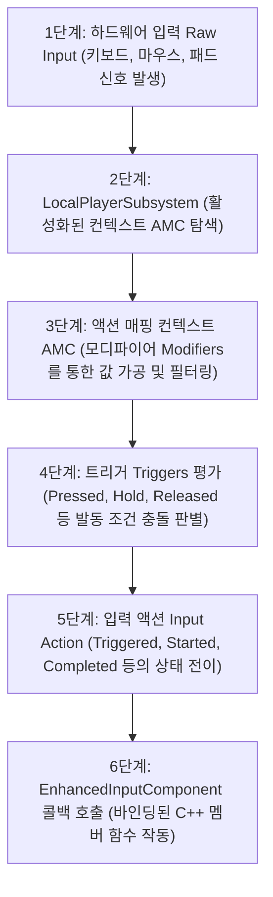

[◀ UE5 C++ 개발 대시보드로 돌아가기](./UE5.md)

# Unreal Engine 5 프레임워크 및 입력 연동 가이드

언리얼 엔진 게임플레이 프레임워크의 기초 에이전트 단위인 `APawn`과 비빙의 액터의 입력 제어를 위한 `EAutoReceiveInput`에 대해 정리합니다.

---

## 1. APawn
`AActor`를 상속받으며, 플레이어 또는 인공지능(AI)에 의해 **빙의(Possess)**되어 컨트롤러 입력 신호를 바탕으로 월드 상에서 주도적인 거동이나 논리 처리를 수행하는 모든 에이전트의 물리적 신체(Avatar) 기본 클래스입니다.

### 핵심 목적
- 플레이어의 입력 디바이스 조작 신호를 물리적 피드백(이동, 회전, 공격 등)으로 전환하기 위함.
- 컨트롤러(Controller)와의 느슨한 결합(Decoupling)을 구현하여, 동일한 신체 객체를 여러 컨트롤러(AI 혹은 인간 플레이어)가 교대로 빙의 조작 가능하도록 설계하기 위함.

### 파라미터 상세 (주요 멤버 변수 및 가상 함수)
- `Controller`: 이 폰을 현재 빙의하여 조율하고 있는 `AController` 클래스의 인스턴스 주소를 보관하는 멤버 포인터입니다.
- `SetupPlayerInputComponent(UInputComponent* PlayerInputComponent)`: 플레이어 컨트롤러의 디바이스 입력 이벤트를 폰 클래스 내부 멤버 함수에 바인딩하기 위해 오버라이딩하는 핵심 가상 함수입니다.
- `PossessedBy(AController* NewController)`: 서버 환경에서 이 폰에 신규 컨트롤러가 빙의 완료되었을 때 실행되는 C++ 가상 이벤트 지점입니다. (주로 서버 권한의 게임 상태 초기화에 활용됩니다.)
- `UnPossessed()`: 기존 컨트롤러가 이 폰에서 연결 해제(빙의 해제)되었을 때 클라이언트 및 서버 모두에서 공통 실행되는 수명 주기 함수입니다.

### 반환 값
- 클래스 정의 포맷이므로 자체 반환값은 없습니다. 다만 `GetController()`, `GetPendingController()`와 같은 게터 API 호출 시 이를 빙의 중인 해당 컨트롤러 객체 주소를 반환합니다.

### 기술적 팁 (Technical Tips)
- **빙의 상태 전이 (Possession):** 폰은 컨트롤러 없이 단독 스폰될 수도 있습니다. 빙의가 일어나기 전에는 `GetController()`가 `nullptr`을 반환하므로, 폰 내부 틱(Tick) 등에서 컨트롤러 객체에 접근할 때는 반드시 포인터 유효성 검사(`IsValid()` 혹은 `nullptr` 체크)가 선행되어야 예기치 못한 크래시를 방지할 수 있습니다.
- **ACharacter 클래스와의 구조적 비교:** `APawn`은 기본적인 빙의 통로와 수동적인 무브먼트 부착 메커니즘만 지원하며 중력/이족보행 등의 고차원 물리 계산은 제공하지 않습니다. 만약 중력의 영향을 받는 일반적인 인간형 캐릭터를 제작한다면 `APawn`을 더 고도화하여 캡슐 충돌체(`UCapsuleComponent`)와 특화 네트워킹 이동 컴포넌트(`UCharacterMovementComponent`)가 사전 래핑된 하위 클래스인 `ACharacter`를 상속받아 사용하는 것이 훨씬 생산적입니다.

### 예시 코드
```cpp
// AMyPawn.h
UCLASS()
class MYPROJECT_API AMyPawn : public APawn
{
    GENERATED_BODY()

public:
    AMyPawn();

    // 입력 처리 바인딩을 위한 오버라이드
    virtual void SetupPlayerInputComponent(class UInputComponent* PlayerInputComponent) override;

protected:
    UPROPERTY(VisibleAnywhere, BlueprintReadOnly, Category = "Components")
    class UCapsuleComponent* CapsuleCollision;

    UPROPERTY(VisibleAnywhere, BlueprintReadOnly, Category = "Movement")
    class UPawnMovementComponent* MovementComponent;
};

// AMyPawn.cpp
AMyPawn::AMyPawn()
{
    // 생성자에서 루트 충돌 컴포넌트 할당
    CapsuleCollision = CreateDefaultSubobject<UCapsuleComponent>(TEXT("CapsuleCollision"));
    RootComponent = CapsuleCollision;

    // 이동을 전담할 무브먼트 컴포넌트 할당 (트랜스폼이 없는 UActorComponent 계열)
    MovementComponent = CreateDefaultSubobject<UPawnMovementComponent>(TEXT("MovementComponent"));
    
    // 무브먼트 컴포넌트가 연산 결과에 맞춰 위치를 갱신할 타겟 루트 컴포넌트 지정
    MovementComponent->UpdatedComponent = RootComponent;
}

void AMyPawn::SetupPlayerInputComponent(UInputComponent* PlayerInputComponent)
{
    Super::SetupPlayerInputComponent(PlayerInputComponent);
    // 여기에 향상된 입력 시스템(Enhanced Input) 액션 바인딩 기입
}
```

---

## 2. EAutoReceiveInput
액터(Actor)가 월드에 스폰되거나 배치되었을 때, 플레이어 컨트롤러의 하드웨어 조작 신호(키보드, 마우스, 게임패드 등)를 자동으로 가로채 입력 컴포넌트(`UInputComponent`)를 초기화 및 바인딩하도록 명령하는 열거형(Enum) 설정값 식별자입니다.

### 핵심 목적
- 컨트롤러가 폰(Pawn)에 직접 빙의(Possess)하지 않더라도, 월드 내에 일반 배치된 액터가 특정 플레이어의 조작 명령을 자동으로 직접 다이렉트 수신할 수 있도록 활성화하기 위함.

### 파라미터 상세 (열거형 주요 멤버)
- `EAutoReceiveInput::Disabled`: 입력을 자동으로 수신하지 않습니다. (기본 디폴트 상태. 보통 Pawn의 가동 라이프사이클에 맞춰 연동 제어됩니다.)
- `EAutoReceiveInput::Player0` ~ `EAutoReceiveInput::Player7`: 0번(기본 1인칭 싱글 플레이어)부터 7번까지 지정한 특정 로컬 플레이어 컨트롤러의 하드웨어 입력 채널을 이 액터가 강제로 자동 청취하도록 구성합니다.

### 반환 값
- 네임스페이스 상의 열거형 상수 구조체이므로 별도 반환값은 없으며, 액터 클래스의 멤버 변수 `AutoReceiveInput`의 설정값으로 활용됩니다.

### 기술적 팁 (Technical Tips)
- **비빙의 상호작용 개체 구현:** 월드 내의 잠겨 있는 상자, 여닫이 문, 복잡한 퍼즐 제어 장치 등 플레이어가 직접 빙의하여 조종하지는 않지만 가까이 가서 특정 조작(예: F키 눌러 상호작용)을 해야 하는 인터랙티브 액터를 구현할 때, `AutoReceiveInput = EAutoReceiveInput::Player0` 설정을 부여하면 복잡한 폰 경유 로직 없이 액터 내부에서 직접 입력을 즉각 청취 및 실행할 수 있습니다.
- **우선순위(InputPriority) 조율:** 여러 개체가 동일한 플레이어의 입력 가로채기를 시도할 경우 입력의 점유 충돌이 발생할 수 있습니다. 이때는 액터 내부의 `InputPriority` 정수 변수 값을 높게 설정하여 입력 파이프라인의 우선 도달 순위를 명시적으로 통제해야 예기치 않은 입력 가로채기 먹통 현상을 막을 수 있습니다.

### 예시 코드
```cpp
// AInteractiveLever.h
UCLASS()
class MYPROJECT_API AInteractiveLever : public AActor
{
    GENERATED_BODY()

public:
    AInteractiveLever();

protected:
    UPROPERTY(VisibleAnywhere, Category = "Components")
    class USceneComponent* RootScene;

    UPROPERTY(VisibleAnywhere, Category = "Components")
    class UStaticMeshComponent* LeverMesh;
};

// AInteractiveLever.cpp
AInteractiveLever::AInteractiveLever()
{
    RootScene = CreateDefaultSubobject<USceneComponent>(TEXT("RootScene"));
    RootComponent = RootScene;

    LeverMesh = CreateDefaultSubobject<UStaticMeshComponent>(TEXT("LeverMesh"));
    // 1. 생성자에서 SetupAttachment를 이용해 씬 컴포넌트 하이러키 빌드
    LeverMesh->SetupAttachment(RootComponent);

    // 2. 폰 빙의 없이 플레이어 0번의 조작 입력을 자동으로 청취하도록 설정
    AutoReceiveInput = EAutoReceiveInput::Player0;
}
```

---

## 3. 향상된 입력(Enhanced Input) 시스템 워크플로우

향상된 입력(Enhanced Input) 시스템은 단순 1대1 키 매핑을 탈피하여, 모디파이어(Modifiers)와 트리거(Triggers)를 경유해 입력 데이터를 정형화하고 런타임에 입력 컨텍스트를 동적으로 결합/분리하는 고도화된 프레임워크입니다. 하드웨어 입력이 C++ 멤버 함수 콜백으로 도달하는 구체적인 워크플로우는 다음과 같습니다.

### ① 입력 신호 전파 시퀀스 (Input Flow)



---

### ② 단계별 내부 메커니즘 상세

#### 1. 하드웨어 입력 발생 (Raw Input Device)
- 사용자의 컨트롤러, 마우스, 키보드 등의 물리 장치 입력이 플랫폼 뷰포트 레이어를 거쳐 엔진 내부로 유입됩니다.

#### 2. EnhancedInputLocalPlayerSubsystem 탐색
- 입력 데이터가 로컬 플레이어와 매핑된 **`UEnhancedInputLocalPlayerSubsystem`**에 도달합니다.
- 이 서브시스템은 현재 플레이어에게 활성화(`AddMappingContext`)되어 있는 **액션 매핑 컨텍스트(Action Mapping Context, AMC)**들의 우선순위(Priority)를 분석합니다.

#### 3. 액션 매핑 컨텍스트 (AMC) 및 모디파이어 (Modifiers) 통과
- 활성화된 컨텍스트 내에서 물리 키와 바인딩된 입력 액션(`UInputAction`)을 매핑합니다.
- 입력 구조에 설정된 **모디파이어(Modifiers)**들이 로우(Raw) 입력 데이터를 변환 및 가공합니다.
  - *Swizzle Input Axis Values:* 1차원 Float 입력을 2차원/3차원 좌표계(X, Y, Z축)로 축을 스왑합니다.
  - *Negate:* 입력 값을 반전(음수화)시킵니다. (예: S키 입력 시 앞으로 이동 축 값에 -1을 곱함)
  - *Dead Zone:* 아날로그 조이스틱의 미세한 쏠림 노이즈 오차를 차단합니다.

#### 4. 트리거 (Triggers) 평가
- 가공된 입력 데이터가 **트리거(Triggers)** 규칙을 통과하는지 검증합니다.
  - *Down:* 키를 누르고 있는 매 프레임 동작을 유발합니다.
  - *Pressed:* 키를 누른 최초 1프레임에만 유발합니다.
  - *Hold:* 키를 누르고 지정한 초 단위 시간이 경과해야 유발합니다.

#### 5. 입력 액션 (Input Action, IA) 상태 방출
- 트리거 조건이 충족되면, 입력 액션의 상태(State)가 결정되어 콜백 델리게이트를 유발합니다.
  - **`Started`:** 트리거 평가가 시작된 첫 프레임.
  - **`Triggered`:** 트리거 조건이 계속 충족되고 있는 상태 (매 프레임 호출).
  - **`Ongoing`:** 트리거(예: Hold) 조건이 동작 중이지만 아직 완결 조건에 미달한 상태.
  - **`Completed`:** 트리거 조건이 최종 완료된 프레임.
  - **`Canceled`:** 트리거 작동 도중 입력이 중단된 상태.

#### 6. EnhancedInputComponent 바인딩 및 함수 호출
- 액터 또는 캐릭터의 `SetupPlayerInputComponent` 가상 함수 내에서 캐스팅하여 획득한 **`UEnhancedInputComponent`**를 통해, 등록해 둔 C++ 멤버 함수가 트리거 상태에 맞춰 호출됩니다.

---

### ③ 기술적 팁 (Technical Tips)
- **컨텍스트 우선순위 관리:** UI 마우스 상호작용 상태이거나 운송수단(Vehicle) 탑승 시에는 기존 보행 컨텍스트의 우선순위보다 더 높은 우선순위로 새로운 컨텍스트를 추가하거나, 기존 컨텍스트를 서브시스템에서 `RemoveMappingContext`로 제거해야 입력의 혼선이 차단됩니다.
- **Null 포인터 주의:** `UEnhancedInputLocalPlayerSubsystem`은 `APlayerController` 객체로부터 획득하므로, 멀티플레이어 환경의 더미(Client Proxy) 액터나 AI가 조작하는 폰 등 **로컬 플레이어 컨트롤러가 부재한 객체**에서는 서브시스템 쿼리 시 `nullptr`이 반환되어 충돌이 유발될 수 있으므로 예외 처리를 반드시 탑재해야 합니다.

---

### ④ C++ 예시 코드

#### `MyCharacter.h` (헤더 선언)
```cpp
#pragma once

#include "CoreMinimal.h"
#include "GameFramework/Character.h"
#include "InputActionValue.h" // Input Action 값 획득용 헤더
#include "MyCharacter.generated.h"

UCLASS()
class MYPROJECT_API AMyCharacter : public ACharacter
{
    GENERATED_BODY()

public:
    AMyCharacter();

    virtual void SetupPlayerInputComponent(class UInputComponent* PlayerInputComponent) override;

protected:
    // 1. 에셋 형태로 대입할 액션 매핑 컨텍스트(AMC)와 입력 액션(IA) 전방 선언
    UPROPERTY(EditAnywhere, BlueprintReadOnly, Category = "Input")
    class UInputMappingContext* DefaultMappingContext;

    UPROPERTY(EditAnywhere, BlueprintReadOnly, Category = "Input")
    class UInputAction* MoveAction;

    // 2. 바인딩할 콜백 함수
    void Move(const FInputActionValue& Value);
};
```

#### `MyCharacter.cpp` (구현부)
```cpp
#include "MyCharacter.h"
#include "EnhancedInputComponent.h"
#include "EnhancedInputSubsystems.h"

AMyCharacter::AMyCharacter()
{
}

void AMyCharacter::SetupPlayerInputComponent(UInputComponent* PlayerInputComponent)
{
    Super::SetupPlayerInputComponent(PlayerInputComponent);

    // 1. Enhanced Input Subsystem 획득 및 컨텍스트 등록
    if (APlayerController* PC = Cast<APlayerController>(GetController()))
    {
        if (UEnhancedInputLocalPlayerSubsystem* Subsystem = ULocalPlayer::GetSubsystem<UEnhancedInputLocalPlayerSubsystem>(PC->GetLocalPlayer()))
        {
            // 가장 낮은 우선순위(0)로 디폴트 매핑 컨텍스트 활성화
            Subsystem->AddMappingContext(DefaultMappingContext, 0);
        }
    }

    // 2. EnhancedInputComponent에 C++ 멤버 함수 바인딩
    if (UEnhancedInputComponent* EnhancedInputComponent = Cast<UEnhancedInputComponent>(PlayerInputComponent))
    {
        // MoveAction이 'Triggered' 상태일 때 Move 함수 호출 지정
        EnhancedInputComponent->BindAction(MoveAction, ETriggerEvent::Triggered, this, &AMyCharacter::Move);
    }
}

void AMyCharacter::Move(const FInputActionValue& Value)
{
    // 모디파이어를 거쳐 2D 벡터 구조로 정형화된 입력값 파싱
    FVector2D MovementVector = Value.Get<FVector2D>();

    if (Controller != nullptr)
    {
        // 컨트롤러의 회전 방향을 기준으로 전방 및 우측 이동 벡터 산출
        const FRotator Rotation = Controller->GetControlRotation();
        const FRotator YawRotation(0, Rotation.Yaw, 0);

        const FVector ForwardDirection = FRotationMatrix(YawRotation).GetUnitAxis(EAxis::X);
        const FVector RightDirection = FRotationMatrix(YawRotation).GetUnitAxis(EAxis::Y);

        // 입력 축 강도에 맞추어 실제 물리 이동 적용
        AddMovementInput(ForwardDirection, MovementVector.Y);
        AddMovementInput(RightDirection, MovementVector.X);
    }
}
```

---

## 4. 향상된 입력(Enhanced Input) 구현 핵심 API 및 문법

C++ 소스코드 레벨에서 향상된 입력 시스템을 성공적으로 수립하고 제어하기 위해 필수적으로 요구되는 핵심 클래스, 구조체 및 바인딩 인터페이스에 대한 명세입니다.

### ① UEnhancedInputLocalPlayerSubsystem
로컬 플레이어 단위에서 입력 매핑 컨텍스트(Input Mapping Context, IMC)의 우선순위를 부여하여 활성화하거나 동적으로 해제 제어하는 생명 주기 서브시스템입니다.

- **핵심 목적:** 플레이어의 조작 상황(보행, 운전, UI 모드 등)에 맞춰 실시간으로 조작 매핑 규칙을 컨텍스트 단위로 주입 및 격리하기 위함.
- **주요 함수 파라미터:**
  - `AddMappingContext(const UInputMappingContext* MappingContext, int32 Priority)`:
    - `MappingContext`: 활성화할 IMC 에셋 주소입니다.
    - `Priority`: 컨텍스트 간의 우선순위 가중치입니다. 숫자가 높을수록 동일 장치 키 입력 바인딩 시 다른 하위 컨텍스트의 입력을 덮어써 가로챕니다.
  - `RemoveMappingContext(const UInputMappingContext* MappingContext)`:
    - 활성화되어 있던 특정 IMC를 해제하여 입력 목록에서 소거합니다.
- **반환 값:** 각 기능 함수는 별도의 데이터를 반환하지 않는 `void` 형식입니다.
- **기술적 팁 (Technical Tips):**
  - **Null 검증의 중요성:** 이 서브시스템은 `LocalPlayer` 주소를 통하여 싱글톤 형식으로 가져옵니다. 그러나 로컬 플레이어 컨트롤러를 갖지 않는 클라이언트 액터 대리 프록시(Simulated Proxy)나 서버 AI 컨트롤러가 지배하는 폰에서는 `PC->GetLocalPlayer()` 호출 결과가 `nullptr`을 도출하므로, 예외 검사 없이 서브시스템 메서드를 즉시 호출하면 100% 런타임 크래시가 유발됩니다.

---

### ② UEnhancedInputComponent
언리얼 C++의 기존 입력 컴포넌트(`UInputComponent`)를 상속 확장하여, 향상된 입력 액션(`UInputAction`) 에셋과 C++의 클래스 멤버 콜백 함수 간의 델리게이트 바인딩을 전담하는 컴포넌트 클래스입니다.

- **핵심 목적:** 특정 입력 액션의 상태(Started, Triggered 등)가 트리거되었을 때, 그 신호를 받아 가공된 데이터를 들고 작동할 C++ 함수를 명시적으로 체인 바인딩하기 위함.
- **주요 함수 파라미터:**
  - `BindAction(const UInputAction* Action, ETriggerEvent TriggerEvent, UserClass* Object, FuncType Func)`:
    - `Action`: 호출 기준이 될 입력 액션(IA) 에셋 주소입니다.
    - `TriggerEvent`: 발동 타이밍을 조율할 트리거 상태 플래그입니다 (`ETriggerEvent::Started`, `ETriggerEvent::Triggered`, `ETriggerEvent::Completed` 등).
    - `Object`: 델리게이트를 소유한 대상 인스턴스 주소입니다 (주로 자기 자신을 가리키는 `this` 포인터).
    - `Func`: 트리거 조건 만족 시 즉시 후속 가동할 클래스 멤버 함수의 주소입니다 (예: `&AMyCharacter::Move`).
- **반환 값:** 바인딩을 식별하고 관리할 수 있는 `FEnhancedInputBindSignature` 구조체 정보를 반환합니다.

---

### ③ FInputActionValue
모디파이어(Modifiers) 가공 단계를 완수하고 최종 방출된 입력 액션의 로우 데이터를 C++ 코드가 판독할 수 있도록 가변 타입으로 캡슐화하여 전달하는 구조체 변수 타입입니다.

- **핵심 목적:** 조이스틱(Axis2D), 트리거 패드(Axis1D), 키보드(Boolean) 등 이기종 디바이스의 다차원 입력 형태를 하나의 매개변수 구조체 규격으로 단일화하여 콜백 인자로 전달받기 위함.
- **주요 함수 파라미터:**
  - `Get<T>()` [템플릿 함수]:
    - `T` (템플릿 타입): 수신하고자 하는 구체적 차원 형식입니다.
    - `bool` (디지털 On/Off), `float` (1D 아날로그 스로틀 등), `FVector2D` (2D 무브먼트 평면 축), `FVector` (3D 가속도 공간 축) 등을 지원합니다.
- **반환 값:** 지정된 템플릿 인자 `T` 형식에 최적화하여 래핑된 최종 수치값을 반환합니다.

---

### ④ 구현 관용 스니펫 예시
```cpp
// 1. SetupPlayerInputComponent 가상 함수 오버라이딩 시의 전형적 바인딩 로직
void AMyPlayerCharacter::SetupPlayerInputComponent(UInputComponent* PlayerInputComponent)
{
    Super::SetupPlayerInputComponent(PlayerInputComponent);

    // 가동 중인 로컬 플레이어 컨트롤러를 획득하여 서브시스템 검출
    if (APlayerController* PC = Cast<APlayerController>(GetController()))
    {
        if (UEnhancedInputLocalPlayerSubsystem* Subsystem = ULocalPlayer::GetSubsystem<UEnhancedInputLocalPlayerSubsystem>(PC->GetLocalPlayer()))
        {
            // 디폴트 매핑 컨텍스트(IMC) 주입 (우선순위 0)
            Subsystem->AddMappingContext(DefaultMappingContext, 0);
        }
    }

    // InputComponent를 Enhanced 버전으로 형변환하여 델리게이트 등록
    if (UEnhancedInputComponent* EnhancedInputComponent = Cast<UEnhancedInputComponent>(PlayerInputComponent))
    {
        // 점프(Jump) 액션이 최초 시작(Started)될 때 캐릭터 점프 함수 수행
        EnhancedInputComponent->BindAction(JumpAction, ETriggerEvent::Started, this, &ACharacter::Jump);

        // 조종(Move) 액션이 유지(Triggered)되는 동안 이동 멤버 함수 호출
        EnhancedInputComponent->BindAction(MoveAction, ETriggerEvent::Triggered, this, &AMyPlayerCharacter::Move);
    }
}

// 2. FInputActionValue 매개변수를 참조하는 콜백 함수 구현 바디
void AMyPlayerCharacter::Move(const FInputActionValue& Value)
{
    // 입력 값에서 2차원 float 벡터 평면 값 복구
    FVector2D MovementVector = Value.Get<FVector2D>();

    // 방향을 감안하여 실제 캐릭터 위치 변경 유도
    AddMovementInput(GetActorForwardVector(), MovementVector.Y);
    AddMovementInput(GetActorRightVector(), MovementVector.X);
}
```

