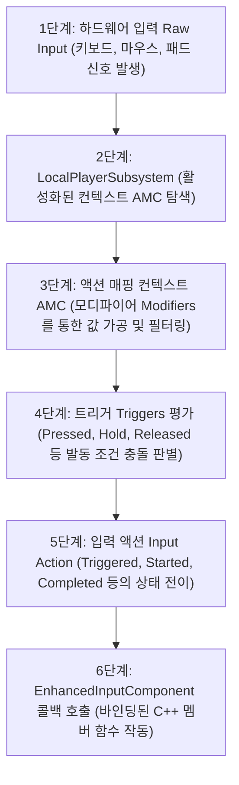
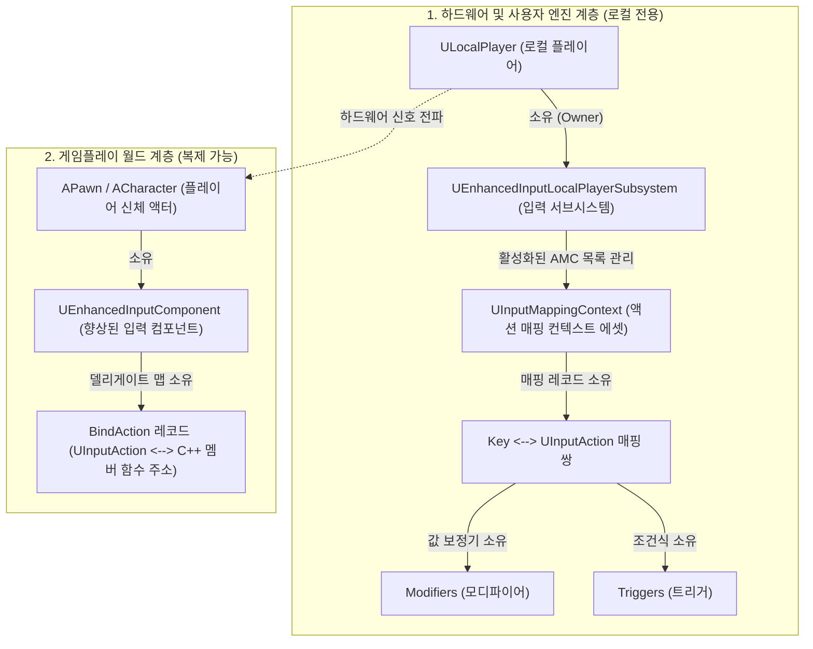

[◀ UE5 C++ 개발 대시보드로 돌아가기](./UE5.md)

# Unreal Engine 5 프레임워크 및 입력 연동 가이드

언리얼 엔진 게임플레이 프레임워크의 기초 에이전트 단위인 `APawn`과 비빙의 액터의 입력 제어를 위한 `EAutoReceiveInput`에 대해 정리합니다.

---

## 1. APawn
`AActor`를 상속받으며, 플레이어 또는 인공지능(AI)에 의해 **빙의(Possess)**되어 컨트롤러 입력 신호를 바탕으로 월드 상에서 주도적인 거동이나 논리 처리를 수행하는 모든 에이전트의 물리적 신체(Avatar) 기본 클래스입니다.

### 핵심 목적
- 플레이어의 입력 디바이스 조작 신호를 물리적 피드백(이동, 회전, 공격 등)으로 전환하기 위함.
- 컨트롤러(Controller)와의 느슨한 결합(Decoupling)을 구현하여, 동일한 신체 객체를 여러 컨트롤러(AI 혹은 인간 플레이어)가 교대로 빙의 조작 가능하도록 설계하기 위함.

### 파라미터 상세 (주요 멤버 변수 및 가상 함수)
- `Controller`: 이 폰을 현재 빙의하여 조율하고 있는 `AController` 클래스의 인스턴스 주소를 보관하는 멤버 포인터입니다.
- `SetupPlayerInputComponent(UInputComponent* PlayerInputComponent)`: 플레이어 컨트롤러의 디바이스 입력 이벤트를 폰 클래스 내부 멤버 함수에 바인딩하기 위해 오버라이딩하는 핵심 가상 함수입니다.
- `PossessedBy(AController* NewController)`: 서버 환경에서 이 폰에 신규 컨트롤러가 빙의 완료되었을 때 실행되는 C++ 가상 이벤트 지점입니다. (주로 서버 권한의 게임 상태 초기화에 활용됩니다.)
- `UnPossessed()`: 기존 컨트롤러가 이 폰에서 연결 해제(빙의 해제)되었을 때 클라이언트 및 서버 모두에서 공통 실행되는 수명 주기 함수입니다.

### 반환 값
- 클래스 정의 포맷이므로 자체 반환값은 없습니다. 다만 `GetController()`, `GetPendingController()`와 같은 게터 API 호출 시 이를 빙의 중인 해당 컨트롤러 객체 주소를 반환합니다.

### 기술적 팁 (Technical Tips)
- **빙의 상태 전이 (Possession):** 폰은 컨트롤러 없이 단독 스폰될 수도 있습니다. 빙의가 일어나기 전에는 `GetController()`가 `nullptr`을 반환하므로, 폰 내부 틱(Tick) 등에서 컨트롤러 객체에 접근할 때는 반드시 포인터 유효성 검사(`IsValid()` 혹은 `nullptr` 체크)가 선행되어야 예기치 못한 크래시를 방지할 수 있습니다.
- **ACharacter 클래스와의 구조적 비교:** `APawn`은 기본적인 빙의 통로와 수동적인 무브먼트 부착 메커니즘만 지원하며 중력/이족보행 등의 고차원 물리 계산은 제공하지 않습니다. 만약 중력의 영향을 받는 일반적인 인간형 캐릭터를 제작한다면 `APawn`을 더 고도화하여 캡슐 충돌체(`UCapsuleComponent`)와 특화 네트워킹 이동 컴포넌트(`UCharacterMovementComponent`)가 사전 래핑된 하위 클래스인 `ACharacter`를 상속받아 사용하는 것이 훨씬 생산적입니다.

### 예시 코드
```cpp
// AMyPawn.h
UCLASS()
class MYPROJECT_API AMyPawn : public APawn
{
    GENERATED_BODY()

public:
    AMyPawn();

    // 입력 처리 바인딩을 위한 오버라이드
    virtual void SetupPlayerInputComponent(class UInputComponent* PlayerInputComponent) override;

protected:
    UPROPERTY(VisibleAnywhere, BlueprintReadOnly, Category = "Components")
    class UCapsuleComponent* CapsuleCollision;

    UPROPERTY(VisibleAnywhere, BlueprintReadOnly, Category = "Movement")
    class UPawnMovementComponent* MovementComponent;
};

// AMyPawn.cpp
AMyPawn::AMyPawn()
{
    // 생성자에서 루트 충돌 컴포넌트 할당
    CapsuleCollision = CreateDefaultSubobject<UCapsuleComponent>(TEXT("CapsuleCollision"));
    RootComponent = CapsuleCollision;

    // 이동을 전담할 무브먼트 컴포넌트 할당 (트랜스폼이 없는 UActorComponent 계열)
    MovementComponent = CreateDefaultSubobject<UPawnMovementComponent>(TEXT("MovementComponent"));
    
    // 무브먼트 컴포넌트가 연산 결과에 맞춰 위치를 갱신할 타겟 루트 컴포넌트 지정
    MovementComponent->UpdatedComponent = RootComponent;
}

void AMyPawn::SetupPlayerInputComponent(UInputComponent* PlayerInputComponent)
{
    Super::SetupPlayerInputComponent(PlayerInputComponent);
    // 여기에 향상된 입력 시스템(Enhanced Input) 액션 바인딩 기입
}
```

---

## 2. EAutoReceiveInput
액터(Actor)가 월드에 스폰되거나 배치되었을 때, 플레이어 컨트롤러의 하드웨어 조작 신호(키보드, 마우스, 게임패드 등)를 자동으로 수신하도록 설정하는 열거형 옵션입니다. 플레이어 컨트롤러에 빙의되지 않은 일반 액터(예: 상자, 문, 스위치 등)가 유저 입력을 감지해 반응해야 할 때 주로 활용됩니다.
- **Disabled**: 자동 입력 수신을 하지 않습니다 (기본값).
- **Player0 ~ Player7**: 지정된 로컬 플레이어 인덱스로부터 입력을 수신하도록 설정합니다.

---

## 3. 향상된 입력(Enhanced Input) 시스템 워크플로우 및 구현 가이드

향상된 입력(Enhanced Input) 시스템은 단순 1대1 키 매핑을 탈피하여, 모디파이어(Modifiers)와 트리거(Triggers)를 경유해 입력 데이터를 정형화하고 런타임에 입력 컨텍스트를 동적으로 결합/분리하는 고도화된 프레임워크입니다.

### ① 입력 신호 전파 시퀀스 (Input Flow)



---

### ② 단계별 구현 워크플로우 (Implementation Steps)

C++ 소스코드 레벨에서 Enhanced Input을 구현할 때는 크게 **초기화(Subsystem 등록)**, **바인딩(Binding)**, **콜백 함수 구현(Callback)**의 3단계로 구조화되어 진행됩니다.

#### 1단계: Input Mapping Context (IMC) 등록 (BeginPlay)
입력 시스템을 활성화하고 하드웨어 입력을 수신하기 위해 `UEnhancedInputLocalPlayerSubsystem`에 설정된 IMC 에셋을 등록해야 합니다. APlayerController에서 서브시스템을 캐스팅하여 직접 가져오는 것이 아니라, 플레이어 컨트롤러를 거쳐 로컬 플레이어 객체로부터 서브시스템을 추출하는 것이 정석입니다.
- **APlayerController 확보:** `BeginPlay()` 함수 내에서 캐릭터 혹은 액터를 제어 중인 `APlayerController` 인스턴스를 확보합니다.
- **ULocalPlayer 취득:** 확보된 APlayerController로부터 로컬 디바이스 처리를 전담하는 `ULocalPlayer` 객체를 추출합니다.
- **Subsystem 인스턴스 취득:** `ULocalPlayer::GetSubsystem<UEnhancedInputLocalPlayerSubsystem>`을 호출하여 로컬 플레이어에 소속된 입력 서브시스템 인스턴스를 안전하게 검색합니다.
- **IMC 추가:** 서브시스템의 `AddMappingContext` 함수를 호출하여 사전에 제작해 둔 Input Mapping Context(IMC) 에셋을 등록합니다. (우선순위를 지정하여 여러 컨텍스트를 중첩할 수 있습니다.)

#### 2단계: Input Component 바인딩 (SetupPlayerInputComponent)
캐릭터 클래스의 `SetupPlayerInputComponent` 함수 오버라이딩 영역에서 실질적인 조작 신호와 반응할 C++ 멤버 함수를 결합합니다.
- **EnhancedInputComponent 캐스팅:** 매개변수로 주입받는 최상위 `UInputComponent` 포인터를 다운캐스팅하여 `UEnhancedInputComponent` 포인터로 변환합니다. 캐스팅 실패 시 크래시 방지를 위해 안전하게 처리를 종료합니다.
- **BindAction 함수 연결:** 캐스팅 완료된 `EnhancedInputComponent` 객체의 `BindAction` 함수를 호출하여 `UInputAction` 에셋 주소와 호출 타겟 클래스 인스턴스(this), 멤버 함수 주소를 매핑합니다.
- **트리거 타입 매핑:** `ETriggerEvent::Triggered`(지속 입력 상태), `ETriggerEvent::Started`(최초 입력 시점), `ETriggerEvent::Completed`(입력 종료 시점) 등 입력 제어 설계 방식에 맞춰 델리게이트 이벤트 유형을 설정합니다.

#### 3단계: 입력 함수 구현 (Callback Function)
델리게이트를 통해 연결된 실질적인 거동 로직 처리 콜백 함수를 구현합니다.
- **FInputActionValue 참조 매개변수:** 함수 선언 시 가공된 입력 데이터 패키지인 `const FInputActionValue&` 타입을 매개변수로 수신합니다.
- **입력 값 추출 (Type Casting):** 입력 액션의 차원 설정에 알맞은 형식을 지정하여 `Value.Get<FVector2D>()`, `Value.Get<float>()`, 또는 `Value.Get<bool>()` 템플릿 함수를 호출해 가공이 완료된 입력 값들을 추출합니다.
- **이동 및 액션 로직 인가:** 취득한 입력 데이터 세기 값을 활용하여 `AddMovementInput`을 수행하거나 점프, 공격 등의 캐릭터 거동 코드를 작동시킵니다.
- **화면 회전(Look) 처리:** 2차원 마우스/게임패드 조작 입력(`FVector2D`)을 획득하여 `AddControllerYawInput` 및 `AddControllerPitchInput`을 호출함으로써 컨트롤러의 지향 각도를 회전 제어합니다.

---

### ③ C++ 통합 구현 예시

#### `MyCharacter.h` (헤더 선언)
```cpp
#pragma once

#include "CoreMinimal.h"
#include "GameFramework/Character.h"
#include "InputActionValue.h" // Input Action 값 획득용 헤더
#include "MyCharacter.generated.h"

UCLASS()
class MYPROJECT_API AMyCharacter : public ACharacter
{
    GENERATED_BODY()

public:
    AMyCharacter();

protected:
    // 1단계: 수명 주기 시작점에서 IMC 등록 수행을 위한 BeginPlay 재정의
    virtual void BeginPlay() override;

public:
    // 2단계: 입력 컴포넌트 바인딩 오버라이딩
    virtual void SetupPlayerInputComponent(class UInputComponent* PlayerInputComponent) override;

protected:
    // 에셋으로 대입받을 컨텍스트 및 입력 액션 선언
    UPROPERTY(EditAnywhere, BlueprintReadOnly, Category = "Input")
    class UInputMappingContext* DefaultMappingContext;

    UPROPERTY(EditAnywhere, BlueprintReadOnly, Category = "Input")
    class UInputAction* MoveAction;

    UPROPERTY(EditAnywhere, BlueprintReadOnly, Category = "Input")
    class UInputAction* LookAction;

    // 3단계: 입력 콜백 멤버 함수
    void Move(const FInputActionValue& Value);
    void Look(const FInputActionValue& Value);
};
```

#### `MyCharacter.cpp` (구현부)
```cpp
#include "MyCharacter.h"
// 향상된 입력 시스템에서 델리게이트 바인딩을 관리하는 핵심 입력 컴포넌트 헤더
#include "EnhancedInputComponent.h"
// 로컬 플레이어 단위에서 입력 컨텍스트(IMC)를 관리하는 서브시스템 API 헤더
#include "EnhancedInputSubsystems.h"

AMyCharacter::AMyCharacter()
{
    // 클래스 생성자 본문
}

// [1단계: Input Mapping Context (IMC) 등록]
void AMyCharacter::BeginPlay()
{
    // 상위 부모 클래스의 BeginPlay 구문 선행 호출
    Super::BeginPlay();

    // 1. APlayerController 확보
    if (APlayerController* PC = Cast<APlayerController>(GetController()))
    {
        // 2. APlayerController로부터 ULocalPlayer 획득 (로컬 플레이어 서브시스템 추출 정석 단계)
        if (ULocalPlayer* LocalPlayer = PC->GetLocalPlayer())
        {
            // 3. ULocalPlayer에서 UEnhancedInputLocalPlayerSubsystem 싱글톤 인스턴스 취득
            if (UEnhancedInputLocalPlayerSubsystem* Subsystem = ULocalPlayer::GetSubsystem<UEnhancedInputLocalPlayerSubsystem>(LocalPlayer))
            {
                // 4. AddMappingContext 함수를 사용하여 미리 연결해 둔 IMC 추가 (우선순위 0으로 기입)
                if (DefaultMappingContext)
                {
                    Subsystem->AddMappingContext(DefaultMappingContext, 0);
                }
            }
        }
    }
}

// [2단계: Input Component 바인딩]
void AMyCharacter::SetupPlayerInputComponent(UInputComponent* PlayerInputComponent)
{
    // 상위 부모 클래스의 기본 입력 처리 초기화 선행 진행
    Super::SetupPlayerInputComponent(PlayerInputComponent);

    // 1. 기본 UInputComponent를 향상된 기능이 지원되는 UEnhancedInputComponent로 다운캐스팅 수행
    if (UEnhancedInputComponent* EnhancedInputComponent = Cast<UEnhancedInputComponent>(PlayerInputComponent))
    {
        // 2. BindAction 함수를 호출하여 InputAction(MoveAction, LookAction)과 C++ 콜백 멤버 함수 매핑
        // 3. ETriggerEvent::Triggered 플래그를 할당하여 키가 활성화 중인 매 프레임마다 이벤트 감지
        EnhancedInputComponent->BindAction(MoveAction, ETriggerEvent::Triggered, this, &AMyCharacter::Move);
        EnhancedInputComponent->BindAction(LookAction, ETriggerEvent::Triggered, this, &AMyCharacter::Look);
    }
}

// [3단계: 입력 콜백 함수 구현]
void AMyCharacter::Move(const FInputActionValue& Value)
{
    // 1. FInputActionValue 매개변수로부터 Get<FVector2D>()를 호출해 2D 축 값 파싱
    FVector2D MovementVector = Value.Get<FVector2D>();

    // 2. 현재 캐릭터를 소유하고 있는 컨트롤러 주소의 유효성 체크
    if (Controller != nullptr)
    {
        // 컨트롤러의 조준(시선) 방향 회전(Control Rotation) 중 Yaw(좌우)각 추출
        const FRotator Rotation = Controller->GetControlRotation();
        const FRotator YawRotation(0, Rotation.Yaw, 0);

        // Yaw 회전각을 월드 기준 전방(Forward) 및 우측(Right) 방향 단위 벡터로 정사영 변환
        const FVector ForwardDirection = FRotationMatrix(YawRotation).GetUnitAxis(EAxis::X);
        const FVector RightDirection = FRotationMatrix(YawRotation).GetUnitAxis(EAxis::Y);

        // 3. 변환된 방향과 입력된 세기 데이터(Vector X, Y)를 AddMovementInput에 대입하여 실제 액션 수행
        AddMovementInput(ForwardDirection, MovementVector.Y);
        AddMovementInput(RightDirection, MovementVector.X);
    }
}

void AMyCharacter::Look(const FInputActionValue& Value)
{
    // 1. FInputActionValue 매개변수로부터 마우스/스틱 델타 움직임 축 값 파싱
    FVector2D LookAxisVector = Value.Get<FVector2D>();

    if (Controller != nullptr)
    {
        // 2. 입력받은 X(Yaw/좌우) 세기를 컨트롤러 Yaw 회전 수치로 인가
        AddControllerYawInput(LookAxisVector.X);
        // 3. 입력받은 Y(Pitch/상하) 세기를 컨트롤러 Pitch 회전 수치로 인가
        AddControllerPitchInput(LookAxisVector.Y);
    }
}
```

---

## 4. Enhanced Input Subsystem 취득 구문 문법 분석

로컬 플레이어로부터 입력 서브시스템을 조회하는 핵심 조건문 구문은 다음과 같습니다.

```cpp
if (UEnhancedInputLocalPlayerSubsystem* Subsystem = ULocalPlayer::GetSubsystem<UEnhancedInputLocalPlayerSubsystem>(LocalPlayer))
```

각 파트별 상세 분석 및 문법적 의미는 다음과 같습니다.

### ① C++ 조건문 내 변수 선언 및 초기화 (If with Initializer / Declaration)
- **문법 구조:** `if (Type* Pointer = Function())`
- **의미:** `if` 제어 조건식 괄호 내부에서 변수(`Subsystem`)를 직접 선언함과 동시에 우변의 함수 리턴값으로 즉시 초기화하는 C++ 표준 문법입니다.
- **동작 방식:**
  - 우변의 함수 호출 결과 획득한 주소가 **`nullptr`이 아닐 경우(유효한 주소):** `true`로 평가되어 `if` 블록 내부가 실행됩니다.
  - 우변의 결과가 **`nullptr`인 경우(유효하지 않음):** `false`로 평가되어 `if` 블록이 실행되지 않고 안전하게 건너뜁니다.
- **기술적 이점:**
  - **변수 스코프(Scope)의 격리:** 선언된 `Subsystem` 변수의 생명 주기와 가시성이 오직 이 `if` 블록 내부로만 철저히 제한되어, 블록 밖에서 오염되거나 재사용되는 실수를 원천 차단합니다.
  - **가독성 향상:** 포인터 변수 선언 라인과 널 검증(`if (Subsystem != nullptr)`) 분기 라인을 하나의 간결한 문장으로 결합할 수 있어 C++ 코딩 표준에서 적극 장려됩니다.

### ② ULocalPlayer::GetSubsystem\<T\> (템플릿 기반 서브시스템 검색)
- **문법 구조:** `ULocalPlayer::GetSubsystem<TargetSubsystemClass>(LocalPlayerPointer)`
- **의미:** `ULocalPlayer` 클래스의 정적(Static) API로, 템플릿 인자(`<>`)로 전달한 클래스 형식에 부합하는 서브시스템 인스턴스를 메모리 허브로부터 검색해 반환합니다.
- **템플릿 활용 이점:**
  - 템플릿 파라미터로 `<UEnhancedInputLocalPlayerSubsystem>`을 기입했으므로, 컴파일러는 이 함수의 최종 리턴 타입을 해당 포인터 형식으로 확정합니다.
  - 이에 따라 개발자는 일반적인 부모 클래스 포인터를 반환받아 하위 클래스로 재다운캐스팅(`Cast<T>`)하는 추가적인 형변환 구문 작성의 번거로움과 런타임 성능 오버헤드 없이 즉각 안전한 타입의 포인터를 획득하게 됩니다.

### ③ LocalPlayer 인스턴스 전제 조건 검출
- **개념 및 수명 주기 흐름:**
  - 데스크톱 하드웨어를 직접 제어하는 로컬 클라이언트 환경에서는 `LocalPlayer`가 유효한 주소를 반환하여 서브시스템도 정상 취득됩니다.
  - 그러나 **서버(Dedicated Server)** 환경이나 로컬 디바이스와 조작 바인딩이 없는 **AI 컨트롤러**, 혹은 타 클라이언트의 복제 대리인(**Simulated Proxy**) 환경에서는 플레이어 컨트롤러의 `GetLocalPlayer()` 호출 결과가 `nullptr`을 반환합니다.
  - `nullptr` 인자가 `GetSubsystem`으로 전달되면 결국 최종 `Subsystem` 변수도 `nullptr`로 초기화되어 `if` 문이 안전하게 비활성화되므로, 네트워크 환경에서의 예기치 않은 널 포인터 크래시(Null Pointer Crash)를 사전에 차단하는 방어적 프로그래밍의 핵심 역할을 병행합니다.

---

## 5. ULocalPlayer와 APlayerController의 구조적 차이 및 입력 아키텍처

언리얼 엔진의 멀티플레이어 환경과 입력 프레임워크를 정교하게 제어하기 위해서는 두 핵심 제어 클래스의 기하학적 역할 분담 구조를 정확하게 이해해야 합니다.

### ① APlayerController (논리적 게임플레이 에이전트)
- **개념:** 플레이어의 '생각'과 '의지'를 게임 월드 내의 폰(Pawn)에게 전달하고, 게임 모드 및 게임 상태와 소통하는 논리적인 조종 장치입니다.
- **수명 및 네트워크적 특성:**
  - 서버와 클라이언트 간에 물리적으로 **복제(Replication)**됩니다. 즉, 서버에도 클라이언트의 APlayerController에 대칭되는 복제 인스턴스가 존재하여 RPC 통신을 수행합니다.
  - 레벨 이동, 사망 후 리스폰, 관전자 모드 전환 등 게임플레이 상황에 따라 파괴되거나 새로 생성될 수 있는 비교적 가변적인 생명 주기를 지닙니다.

### ② ULocalPlayer (저수준 로컬 하드웨어 연결점)
- **개념:** 로컬 실행 머신(PC, 콘솔 기기 등)의 물리적인 입출력 시스템(Viewport, Screen, Keyboard/Mouse, Audio Device)을 전담 소유하고 점유하는 프로그램 최하위의 실제 플레이어 인스턴스입니다.
- **수명 및 네트워크적 특성:**
  - 절대로 네트워크 상으로 **복제(Replication)되지 않으며**, 오직 입력을 직접 수행하는 로컬 클라이언트 머신의 메모리에만 고유하게 상주합니다.
  - 게임 실행 시부터 프로세스 종료 시까지 영속적으로 존재하며, 화면의 분할(Split Screen)이나 로컬 멀티플레이어가 추가되지 않는 한 1인당 단 1개만 영구 유지되는 영속적인 생명 주기를 지닙니다.

---

### ③ Enhanced Input Subsystem의 LocalPlayer 종속 배경
왜 향상된 입력 서브시스템(`UEnhancedInputLocalPlayerSubsystem`)은 플레이어 컨트롤러가 아니라 로컬 플레이어(`ULocalPlayer`)의 수명 주기에 바인딩되어 작동할까요?

1. **하드웨어 입력 채널의 직접 관리:**
   - 저수준 디바이스 드라이버로부터 물리 입력을 가장 먼저 전달받는 주체는 로컬 머신의 `ULocalPlayer`입니다. 따라서 입력 데이터 처리 및 정형화(Modifiers) 필터링 과정이 하드웨어 접점과 가장 가까운 로컬 플레이어 서브시스템에서 일어나는 것이 성능과 구조 측면에서 가장 효율적입니다.
2. **입력 설정의 영속성 보장:**
   - 게임플레이 도중 캐릭터가 사망하여 컨트롤러가 일시 소멸하거나, 레벨 전환으로 인해 플레이어 컨트롤러 인스턴스가 완전히 재구성되는 런타임 와중에도, 유저가 설정한 커스텀 키 매핑 데이터와 감도 프로필 정보는 프로세스 전반에 걸쳐 유실되지 않고 안전하게 유지되어야 합니다. 수명이 영속적인 `ULocalPlayer`에 입력 데이터를 결합함으로써 매번 컨트롤러 생성 시마다 설정을 처음부터 복원해야 하는 번거로움을 원천 제거한 지능적 설계입니다.

---

## 6. Enhanced Input 핵심 클래스별 포함 관계 및 데이터 흐름

향상된 입력 시스템의 실시간 동작 방식을 깊이 있게 파악하려면 각 클래스들의 **데이터 소유 관계(Inclusion)**와 입력 감지 시의 **데이터 전달(Workflow) 시퀀스**를 계층적으로 맵핑해야 합니다.

### ① 클래스별 소유 관계도 (Inclusion Diagram)



---

### ② 클래스별 소유 데이터 및 데이터 흐름 상의 역할

#### 1. ULocalPlayer (물리 플레이어 접점)
- **포함(소유)하고 있는 것:** `UEnhancedInputLocalPlayerSubsystem` 싱글톤 객체.
- **데이터 흐름 상의 역할:**
  - 마우스 조작, 키보드 타건 등 OS 및 엔진 하부에서 수신한 원시(Raw) 하드웨어 신호를 가장 먼저 수신하여 소유하고 있는 `Subsystem`으로 토스합니다.

#### 2. UEnhancedInputLocalPlayerSubsystem (조작 모드 총괄자)
- **포함(소유)하고 있는 것:** 현재 활성화(Add)된 `UInputMappingContext` (AMC) 목록 및 등록 우선순위(Priority) 테이블.
- **데이터 흐름 상의 역할:**
  - 하드웨어 신호가 감지되면, 현재 켜져 있는 AMC 목록들을 확인하여 해당 입력 키가 유효한 입력 규칙을 가지고 있는지 탐색을 시작합니다.

#### 3. UInputMappingContext (조작 규칙 에셋)
- **포함(소유)하고 있는 것:** 특정 키 $\leftrightarrow$ `UInputAction` 매핑 규칙 구조체, 그리고 각 매핑 구조체에 부착된 모디파이어(Modifiers) 및 트리거(Triggers) 배열.
- **데이터 흐름 상의 역할:**
  - 예를 들어 "W 키가 눌렸다"라는 정보가 오면, **"W 키는 `IA_Move`와 짝이며, 여기에는 값의 차원을 변환하는 Modifiers와 프레임당 가동하는 Triggers 조건이 설정되어 있다"**라는 규칙에 따라 입력 수치를 다듬어 `UInputAction`에 전달합니다.

#### 4. UInputAction (최종 데이터 포맷 패키지)
- **포함(소유)하고 있는 것:** 데이터의 출력 차원 규격(Boolean, Axis1D, Axis2D 등) 및 개별 임계값 설정.
- **데이터 흐름 상의 역할:**
  - AMC 단계를 거쳐 가공된 정형화 데이터와 발동 조건 판정 결과를 수용하여, C++에서 판독 가능한 **`FInputActionValue` 패키지**와 **`ETriggerEvent::Triggered` 등 상태 신호**를 최종 확정합니다.

#### 5. UEnhancedInputComponent (델리게이트 스위칭 허브)
- **포함(소유)하고 있는 것:** 폰의 `SetupPlayerInputComponent` 함수 오버라이딩 시 등록해 둔 `BindAction` 델리게이트 매핑 맵 (입력 액션 주소 $\leftrightarrow$ C++ 멤버 함수 주소).
- **데이터 흐름 상의 역할:**
  - `Subsystem` 측으로부터 "`IA_Move` 액션이 `Triggered` 되었고, 최종 파싱 값은 `(X: 1.0, Y: 0.0)`이다"라는 데이터 패키지를 전달받습니다.
  - 자신이 소유한 델리게이트 맵에서 `IA_Move`에 연결된 캐릭터 클래스 멤버 함수(`AMyCharacter::Move`)를 찾아 호출하면서, 파싱 완료된 데이터 패키지를 매개변수로 넘겨주어 최종 게임플레이 무브먼트를 발동시킵니다.

---

## 7. 향상된 입력(Enhanced Input) C++ 핵심 API 레퍼런스

### [ULocalPlayer::GetSubsystem]
- **핵심 목적:** 로컬 플레이어(`ULocalPlayer`)의 수명 주기에 바인딩된 싱글톤 성격의 서브시스템 인스턴스를 안전하고 동적으로 획득하기 위한 템플릿 정적 게터 함수입니다.
- **파라미터 상세:**
  - `ULocalPlayer* LocalPlayer`: 서브시스템을 조회하고자 하는 대상 로컬 플레이어 인스턴스의 포인터입니다.
- **반환 값:**
  - `T* (Subsystem 인스턴스 포인터)`: 템플릿 인자로 넘겨진 서브시스템 타입에 해당하는 인스턴스 주소를 반환합니다. 만약 인자로 넘긴 `LocalPlayer`가 `nullptr`이거나 해당 서브시스템이 존재하지 않을 경우 `nullptr`을 반환합니다.
- **기술적 팁 (Technical Tips):**
  - AI 컨트롤러나 서버(Dedicated Server) 환경 등 하드웨어 조작 접점이 없는 환경에서는 `PC->GetLocalPlayer()`가 `nullptr`을 반환하므로, 반드시 `if (ULocalPlayer* LocalPlayer = PC->GetLocalPlayer())`와 같이 선행 검증 단계를 거쳐 사용해야 안전합니다.
- **코드 예시:**
  ```cpp
  if (ULocalPlayer* LocalPlayer = PC->GetLocalPlayer())
  {
      UEnhancedInputLocalPlayerSubsystem* Subsystem = ULocalPlayer::GetSubsystem<UEnhancedInputLocalPlayerSubsystem>(LocalPlayer);
  }
  ```

### [UEnhancedInputLocalPlayerSubsystem::AddMappingContext]
- **핵심 목적:** 플레이어의 입력 기기로부터 신호를 감지하고 처리하는 규칙을 정의한 입력 매핑 컨텍스트(Input Mapping Context, IMC)를 서브시스템 작동 큐에 삽입하고 활성화합니다.
- **파라미터 상세:**
  - `const UInputMappingContext* WriteContext`: 활성화하려는 IMC 에셋 포인터입니다.
  - `int32 Priority`: 컨텍스트의 우선순위 값입니다. 숫자가 높을수록 우선순위가 높으며, 여러 IMC가 동일한 입력 키를 매핑했을 때 높은 우선순위의 매핑 데이터가 하위 매핑 데이터를 덮어쓰거나 선점합니다.
  - `const FModifyContextOptions& Options`: (선택사항) 컨텍스트를 추가할 때 수행할 추가 옵션 설정 구조체입니다.
- **반환 값:**
  - 없음 (`void`).
- **기술적 팁 (Technical Tips):**
  - 동적으로 IMC를 결합 및 해제(`RemoveMappingContext`)할 수 있으므로 UI 활성화 시점에 조작키 변경을 유도할 때도 효과적입니다.
  - 액터가 소멸하거나 빙의 해제될 때에는 이 서브시스템에서 컨텍스트를 정리하는 것이 메모리 및 입력 오작동 방지에 유리합니다.
- **코드 예시:**
  ```cpp
  Subsystem->AddMappingContext(DefaultMappingContext, 0);
  ```

### [UEnhancedInputComponent::BindAction]
- **핵심 목적:** `UInputAction` 에셋이 감지되었을 때 호출될 대상 클래스의 특정 멤버 함수(델리게이트 콜백)를 연결합니다.
- **파라미터 상세:**
  - `const UInputAction* Action`: 바인딩할 타겟 입력 액션 에셋 포인터입니다.
  - `ETriggerEvent TriggerEvent`: 이벤트를 발생시킬 트리거 조건입니다 (`Started`, `Triggered`, `Completed`, `Canceled` 등).
  - `UserClass* Object`: 콜백 멤버 함수를 소유하고 실행할 대상 인스턴스 주소(보통 `this`)입니다.
  - `FuncType Func`: 조건 만족 시 실행할 멤버 함수의 메모리 주소입니다.
- **반환 값:**
  - `FEnhancedInputActionEventBinding&`: 바인딩 정보가 담긴 참조 구조체를 반환하며, 필요시 이 참조를 통해 런타임에 바인딩을 끊거나 설정을 동적 제어할 수 있습니다.
- **기술적 팁 (Technical Tips):**
  - 기존 레거시 `UInputComponent::BindAction`과 문법 형태는 유사하지만, `ETriggerEvent` 열거형을 통해 입력 흐름 상태를 훨씬 직관적으로 다룬다는 점이 다릅니다.
  - 매개변수로 수신되는 콜백 함수의 인자는 반드시 `const FInputActionValue&` 구조체 타입이어야 합니다.
- **코드 예시:**
  ```cpp
  EnhancedInputComponent->BindAction(MoveAction, ETriggerEvent::Triggered, this, &AMyCharacter::Move);
  ```

### [APawn::AddControllerYawInput]
- **핵심 목적:** 로컬 플레이어의 입력으로부터 전달받은 좌우 방향 회전(Yaw) 가중치를 컨트롤러에 인가하여 화면 시선을 수평으로 회전시킵니다.
- **파라미터 상세:**
  - `float Val`: 회전에 추가될 Yaw 값 가중치(감도 설정에 영향)입니다.
- **반환 값:**
  - 없음 (`void`).
- **기술적 팁 (Technical Tips):**
  - 폰 클래스에서 `bUseControllerRotationYaw` 속성이 활성화되어 있는 경우, 이 함수를 통해 제어되는 컨트롤러 Yaw 회전 방향에 맞춰 폰(Pawn)의 외형 메쉬도 동적으로 연동되어 회전합니다.
- **코드 예시:**
  ```cpp
  AddControllerYawInput(LookAxisVector.X);
  ```

### [APawn::AddControllerPitchInput]
- **핵심 목적:** 로컬 플레이어의 입력으로부터 전달받은 상하 방향 회전(Pitch) 가중치를 컨트롤러에 인가하여 화면 시선을 수직으로 회전시킵니다.
- **파라미터 상세:**
  - `float Val`: 회전에 추가될 Pitch 값 가중치입니다.
- **반환 값:**
  - 없음 (`void`).
- **기술적 팁 (Technical Tips):**
  - 폰 클래스에서 컨트롤러의 Pitch 값을 이용해 폰 메쉬 전체가 회전하지 않도록 `bUseControllerRotationPitch`는 일반적으로 비활성화 처리하고, 카메라 스프링 암(`USpringArmComponent`)의 `bUsePawnControlRotation`을 설정하여 카메라 각도만 단독 회전시키는 설계가 주로 사용됩니다.
- **코드 예시:**
  ```cpp
  AddControllerPitchInput(LookAxisVector.Y);
  ```


## 8. 애니메이션 인스턴스(AnimInstance) C++ 수명 주기 가이드

### [UAnimInstance::NativeInitializeAnimation]
- **핵심 목적:** 애니메이션 인스턴스가 활성화 및 초기화될 때 1회 호출되며, 컴포넌트나 소유자 액터의 캐싱 등 런타임 연산 최적화를 위한 사전 작업을 처리하는 가상 함수입니다.
- **파라미터 상세:**
  - 없음 (인수 없이 호출).
- **반환 값:**
  - 없음 (`void`)
- **기술적 팁 (Technical Tips):**
  - **캐싱 최적화:** 매 프레임 `TryGetPawnOwner()`를 호출하여 캐스팅하는 연산은 CPU 오버헤드를 유발하므로, 이 함수 내부에서 소유자 Pawn(또는 Character)의 포인터를 미리 캐스팅하여 멤버 변수로 캐싱해 두는 것이 권장됩니다.
  - **안전한 포인터:** 초기화 시점에는 메쉬 컴포넌트가 액터에 완벽히 부착되지 않았거나 소유자 폰이 스폰 전일 수 있으므로 캐싱 시 반드시 `nullptr` 검사를 병행해야 합니다.
- **코드 예시:**
  ```cpp
  // MyAnimInstance.h
  #pragma once
  #include "CoreMinimal.h"
  #include "Animation/AnimInstance.h"
  #include "MyAnimInstance.generated.h"

  UCLASS()
  class MYPROJECT_API UMyAnimInstance : public UAnimInstance
  { 
      GENERATED_BODY()
  public:
      virtual void NativeInitializeAnimation() override;
      virtual void NativeUpdateAnimation(float DeltaSeconds) override;

  protected:
      UPROPERTY(BlueprintReadOnly, Category = "Character")
      class ACharacter* OwnerCharacter;
  };
  ```

### [UAnimInstance::NativeUpdateAnimation]
- **핵심 목적:** 매 프레임 호출되며, 애님 그래프(AnimGraph)에 필요한 캐릭터 조작 수치(속도, 각도, 낙하 상태 등)를 소유자 액터로부터 동기화하여 실시간 변수를 갱신하는 틱(Tick) 성격의 가상 업데이트 함수입니다.
- **파라미터 상세:**
  - `float DeltaSeconds`: 프레임 간 델타 시간(초 단위 경과 시간)입니다.
- **반환 값:**
  - 없음 (`void`)
- **기술적 팁 (Technical Tips):**
  - **방어적 프로그래밍:** 초기화 단계에서 폰 캐싱에 실패했을 가능성이 있으므로, 매 프레임 멤버 포인터 변수의 유효성(`nullptr` 검사)을 반드시 사전에 검사한 후 비즈니스 로직을 동작시켜야 널 포인터 크래시를 방지할 수 있습니다.
  - **스레드 세이프티:** UE 5.0 이상에서는 애니메이션 갱신 작업이 워커 스레드에서 비동기적(병렬)으로 처리되는 경우가 많으므로, 게임플레이 스레드에 상주하는 액터의 컴포넌트에 직접 접근하는 행위는 피하고, 스레드 안전하게 구조화된 데이터 복사 방식을 활용해야 합니다.
- **코드 예시:**
  ```cpp
  // MyAnimInstance.cpp
  #include "MyAnimInstance.h"
  #include "GameFramework/Character.h"
  #include "GameFramework/CharacterMovementComponent.h"

  void UMyAnimInstance::NativeInitializeAnimation()
  { 
      Super::NativeInitializeAnimation();

      // 소유자 캐릭터 포인터를 쿼리하여 캐싱
      if (ACharacter* Char = Cast<ACharacter>(TryGetPawnOwner()))
      { 
          OwnerCharacter = Char;
      }
  }

  void UMyAnimInstance::NativeUpdateAnimation(float DeltaSeconds)
  { 
      Super::NativeUpdateAnimation(DeltaSeconds);

      // 캐싱된 포인터 유효성 검사
      if (OwnerCharacter == nullptr)
      { 
          // 초기화 시점 실패 대비 재쿼리 시도
          OwnerCharacter = Cast<ACharacter>(TryGetPawnOwner());
      }

      if (OwnerCharacter != nullptr)
      { 
          // 캐릭터 속도 및 공중 낙하 여부 갱신 예시
          FVector Velocity = OwnerCharacter->GetVelocity();
          float GroundSpeed = Velocity.Size2D();
          bool bIsFalling = OwnerCharacter->GetCharacterMovement()->IsFalling();
      }
  }
  ```


## 9. C++ 애니메이션 몽타주(Animation Montage) 제어 API

### [UAnimInstance::Montage_Play]
- **핵심 목적:** 지정한 애니메이션 몽타주(`UAnimMontage`) 에셋을 애님 인스턴스에 할당된 슬롯(Slot)을 통해 즉시 재생 연산을 가동시키는 API입니다.
- **파라미터 상세:**
  - `UAnimMontage* MontageToPlay`: 재생시킬 애니메이션 몽타주 에셋 포인터입니다.
  - `float InPlayRate`: 재생 속도 비율(Scale)입니다 (`1.0f`가 기본 1배속, `2.0f`는 2배속 재생).
  - `EMontagePlayReturnType ReturnValueType`: 반환 타입의 성격을 결정합니다 (`MontageLength` 기본 설정 시 몽타주의 총 재생 초 단위 길이 반환).
  - `float InTimeToStartFrom`: 몽타주 내부에서 재생을 시작할 오프셋 타임(초)입니다.
  - `bool bStopAllMontages`: `true`인 경우 기존에 재생되던 다른 슬롯의 몽타주들을 중단하고 새로운 몽타주를 전면 재생합니다.
- **반환 값:**
  - `float`: 몽타주가 성공적으로 가동된 경우 몽타주의 실질 재생 시간(초)을 반환하며, 재생에 실패한 경우 `0.0f`를 반환합니다.
- **기술적 팁 (Technical Tips):**
  - **Slot 노드 구성 필수:** C++에서 `Montage_Play`를 아무리 정상 호출하더라도, 해당 캐릭터의 애니메이션 블루프린트 애님 그래프(AnimGraph) 내에 몽타주에 지정된 슬롯 노드(예: `DefaultSlot` 또는 `UpperBodySlot`)가 연결되어 있지 않으면 화면에 애니메이션 모션이 출력되지 않으므로 그래프 연결 상태를 사전에 점검해야 합니다.
  - **ACharacter::PlayAnimMontage 래핑 함수:** 캐릭터 클래스 자체에서도 `PlayAnimMontage(MontageToPlay, ...)` 래퍼 API를 제공하여 `GetMesh()->GetAnimInstance()` 쿼리 구문을 축약할 수 있습니다.
- **코드 예시:**
  ```cpp
  if (UAnimInstance* AnimInstance = GetMesh()->GetAnimInstance())
  { 
      if (AttackMontage)
      { 
          float MontageLength = AnimInstance->Montage_Play(AttackMontage, 1.0f);
      }
  }
  ```

### [UAnimInstance::Montage_JumpToSection]
- **핵심 목적:** 현재 재생 중이거나 지정한 애니메이션 몽타주 내부의 특정 섹션(Section) 이름 위치로 재생 타임라인을 즉시 점프 이동시키는 분기 제어 API입니다.
- **파라미터 상세:**
  - `FName SectionName`: 몽타주 에셋에 등록된 타깃 섹션의 고유 명칭입니다 (예: `FName("AttackCombo2")`).
  - `const UAnimMontage* Montage`: 대상을 특정할 몽타주 에셋 포인터입니다 (지정하지 않거나 `nullptr` 입력 시 현재 재생 중인 몽타주 대상으로 가동).
- **반환 값:**
  - 없음 (`void`)
- **기술적 팁 (Technical Tips):**
  - **연속 콤보 시스템 구현:** 평타 공격 콤보 시스템 구현 시, `Montage_Play`를 매번 다시 호출하여 처음부터 블렌드 인(Blend In)시키는 대신, 하나의 몽타주 안에 여러 공격 동작 섹션(`Section1`, `Section2`, `Section3`)을 배치해두고 입력 시점에 `Montage_JumpToSection`을 호출하면 애니메이션이 끊김 없이 부드럽게 연결됩니다.
- **코드 예시:**
  ```cpp
  if (UAnimInstance* AnimInstance = GetMesh()->GetAnimInstance())
  { 
      // 콤보 2단계 섹션으로 즉시 타임라인 이동
      AnimInstance->Montage_JumpToSection(FName("Combo02"), AttackMontage);
  }
  ```

### [UAnimInstance::Montage_IsPlaying]
- **핵심 목적:** 특정 애니메이션 몽타주 에셋이 현재 애님 인스턴스 상에서 정상적으로 재생 연산 중인 상태인지 유효성 상태를 쿼리합니다.
- **파라미터 상세:**
  - `const UAnimMontage* Montage`: 재생 여부를 검사할 타깃 몽타주 포인터입니다.
- **반환 값:**
  - `bool`: 몽타주가 현재 블렌드 인/재생 상태에 있으면 `true`, 중단되거나 완료된 상태이면 `false`를 반환합니다.
- **기술적 팁 (Technical Tips):**
  - **중복 입력 차단 (Input Lock):** 피격 중이거나 이미 공격 몽타주가 재생 중일 때 사용자의 추가 공격 입력을 차단하는 조건 분기(`if (!AnimInstance->Montage_IsPlaying(AttackMontage))`)로 활용하여 모션 덮어쓰기 버그를 방지합니다.
- **코드 예시:**
  ```cpp
  bool bIsAttacking = AnimInstance->Montage_IsPlaying(AttackMontage);
  ```


## 10. Enum 기반 애니메이션 몽타주(Animation Montage) 연동 설계 패턴

### [1. Enum-Indexed Montage Mapping 패턴 (TMap<Enum, UAnimMontage*>)]
- **핵심 목적:** 무기 유형(`EWeaponType`), 스킬 종류(`ESkillType`), 피격 부위/방향(`EDamageDirection`) 등의 열거형 상태 키를 기준으로 애니메이션 몽타주 에셋 포인터를 `TMap`에 매핑하여 하드코딩 조건문(`switch/if`) 없이 (1)$ 시간에 동적 룩업 및 재생을 가동하는 데이터 기반 설계 패턴입니다.
- **기술적 팁 (Technical Tips):**
  - **디테일 패널 편집성:** `UPROPERTY(EditAnywhere, Category = "Animation") TMap<EWeaponType, UAnimMontage*> WeaponMontageMap;` 구조로 선언하면, C++ 코드를 수정하지 않고도 에디터 디테일 패널에서 무기 타입별 몽타주 에셋을 유연하게 할당 및 교체할 수 있습니다.
- **코드 예시:**
  ```cpp
  // MyCharacter.h
  UENUM(BlueprintType)
  enum class EWeaponType : uint8
  { 
      BareHand,
      OneHandedSword,
      TwoHandedSword,
      Bow
  };

  UCLASS()
  class AMyCharacter : public ACharacter
  { 
      GENERATED_BODY()
  protected:
      UPROPERTY(EditAnywhere, BlueprintReadOnly, Category = "Animation")
      TMap<EWeaponType, UAnimMontage*> WeaponAttackMontageMap;

      UPROPERTY(VisibleAnywhere, BlueprintReadOnly, Category = "State")
      EWeaponType CurrentWeaponType = EWeaponType::BareHand;

  public:
      void PlayAttackMontageByWeapon();
  };

  // MyCharacter.cpp
  void AMyCharacter::PlayAttackMontageByWeapon()
  {
      // Enum 키값으로 TMap에서 해당 무기 전용 몽타주 탐색
      if (UAnimMontage** FoundMontage = WeaponAttackMontageMap.Find(CurrentWeaponType))
      { 
          if (*FoundMontage && GetMesh()->GetAnimInstance())
          { 
              GetMesh()->GetAnimInstance()->Montage_Play(*FoundMontage);
          }
      }
  }
  ```

### [2. Enum 기반 몽타주 섹션(Section) 점프 및 콤보 제어 패턴]
- **핵심 목적:** 하나의 단일 몽타주 파일 내에 여러 공격 모션 섹션(`Attack01`, `Attack02`, `Attack03`)을 구성하고, 캐릭터의 콤보 단계 열거형(`EComboState`) 수치에 대응하는 섹션 이름(`FName`)을 동적으로 연산하여 끊김 없는 연격 콤보를 구현하는 패턴입니다.
- **기술적 팁 (Technical Tips):**
  - **FName 매핑 연산:** Enum 또는 콤보 카운트 인덱스를 기반으로 `FName(*FString::Printf(TEXT("Attack0%d"), ComboIndex))`와 같이 문자열 파싱 규칙을 적용하거나 Enum 자체를 키로 하는 섹션 이름 맵(`TMap<EComboState, FName>`)을 구축하면 섹션 제어를 캡슐화할 수 있습니다.
- **코드 예시:**
  ```cpp
  UENUM(BlueprintType)
  enum class EComboState : uint8
  { 
      None,
      Combo1,
      Combo2,
      Combo3
  };

  void AMyCharacter::ExecuteComboAttack()
  {
      UAnimInstance* AnimInstance = GetMesh()->GetAnimInstance();
      if (!AnimInstance || !ComboMontage) return;

      if (CurrentComboState == EComboState::None)
      { 
          // 콤보 시작: 몽타주 재생 후 첫 번째 섹션 진입
          CurrentComboState = EComboState::Combo1;
          AnimInstance->Montage_Play(ComboMontage);
          AnimInstance->Montage_JumpToSection(FName("Combo1"), ComboMontage);
      }
      else if (bCanChainCombo) // 노티파이를 통해 입력 윈도우가 열린 상태
      { 
          // 다음 콤보 단계로 Enum 및 타임라인 점프 진행
          bCanChainCombo = false;
          switch (CurrentComboState)
          { 
          case EComboState::Combo1:
              CurrentComboState = EComboState::Combo2;
              AnimInstance->Montage_JumpToSection(FName("Combo2"), ComboMontage);
              break;
          case EComboState::Combo2:
              CurrentComboState = EComboState::Combo3;
              AnimInstance->Montage_JumpToSection(FName("Combo3"), ComboMontage);
              break;
          }
      }
  }
  ```

### [3. AnimNotify & Enum 상태 윈도우 제어 패턴 (Notify & Enum Coordination)]
- **핵심 목적:** 몽타주 타임라인에 배치된 노티파이(AnimNotify) 지점에서 캐릭터의 액션 상태 열거형(`EActionState::ComboWindowOpen`, `EActionState::HitCheckActive`)을 변경하여 입력 제어 윈도우 획득 및 무기 물리 판정을 정밀 제어하는 연동 패턴입니다.
- **기술적 팁 (Technical Tips):**
  - **상태 오염 차단:** 몽타주가 도중에 강제 중단(`Montage_Stop`)되거나 피격될 경우, 노티파이가 정상 호출되지 못해 상태 열거형이 특정 진입 상태에 갇히는(Lock) 버그가 발생할 수 있습니다. 따라서 반드시 `OnMontageEnded` 델리게이트를 바인딩하여 몽타주 종료 시점에 상태 열거형을 `EActionState::Idle` 상태로 원복하는 청소(Cleanup) 로직을 병행해야 합니다.
- **코드 예시:**
  ```cpp
  // 몽타주 종료 델리게이트 바인딩 예시 (BeginPlay 등에서 수행)
  void AMyCharacter::BeginPlay()
  {
      Super::BeginPlay();
      if (UAnimInstance* AnimInstance = GetMesh()->GetAnimInstance())
      { 
          AnimInstance->OnMontageEnded.AddDynamic(this, &AMyCharacter::OnMontageEndedHandler);
      }
  }

  // 몽타주 종료 시 Enum 상태 청소
  void AMyCharacter::OnMontageEndedHandler(UAnimMontage* Montage, bool bInterrupted)
  {
      CurrentActionState = EActionState::Idle;
      CurrentComboState = EComboState::None;
      bCanChainCombo = false;
  }
  ```
