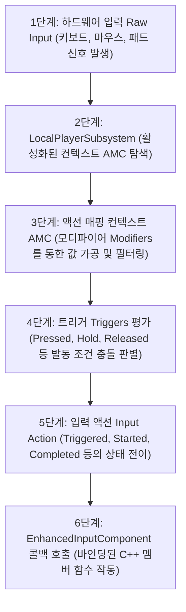
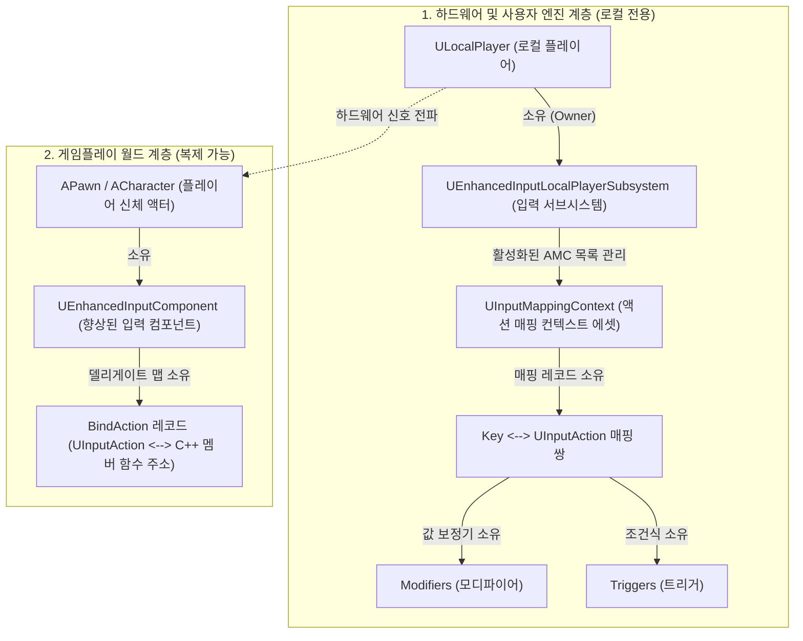

[◀ UE5 C++ 개발 대시보드로 돌아가기](./UE5.md)

# Unreal Engine 5 프레임워크 및 입력 연동 가이드

언리얼 엔진 게임플레이 프레임워크의 기초 에이전트 단위인 `APawn`과 비빙의 액터의 입력 제어를 위한 `EAutoReceiveInput`에 대해 정리합니다.

---

## 1. APawn
`AActor`를 상속받으며, 플레이어 또는 인공지능(AI)에 의해 **빙의(Possess)**되어 컨트롤러 입력 신호를 바탕으로 월드 상에서 주도적인 거동이나 논리 처리를 수행하는 모든 에이전트의 물리적 신체(Avatar) 기본 클래스입니다.

### 핵심 목적
- 플레이어의 입력 디바이스 조작 신호를 물리적 피드백(이동, 회전, 공격 등)으로 전환하기 위함.
- 컨트롤러(Controller)와의 느슨한 결합(Decoupling)을 구현하여, 동일한 신체 객체를 여러 컨트롤러(AI 혹은 인간 플레이어)가 교대로 빙의 조작 가능하도록 설계하기 위함.

### 파라미터 상세 (주요 멤버 변수 및 가상 함수)
- `Controller`: 이 폰을 현재 빙의하여 조율하고 있는 `AController` 클래스의 인스턴스 주소를 보관하는 멤버 포인터입니다.
- `SetupPlayerInputComponent(UInputComponent* PlayerInputComponent)`: 플레이어 컨트롤러의 디바이스 입력 이벤트를 폰 클래스 내부 멤버 함수에 바인딩하기 위해 오버라이딩하는 핵심 가상 함수입니다.
- `PossessedBy(AController* NewController)`: 서버 환경에서 이 폰에 신규 컨트롤러가 빙의 완료되었을 때 실행되는 C++ 가상 이벤트 지점입니다. (주로 서버 권한의 게임 상태 초기화에 활용됩니다.)
- `UnPossessed()`: 기존 컨트롤러가 이 폰에서 연결 해제(빙의 해제)되었을 때 클라이언트 및 서버 모두에서 공통 실행되는 수명 주기 함수입니다.

### 반환 값
- 클래스 정의 포맷이므로 자체 반환값은 없습니다. 다만 `GetController()`, `GetPendingController()`와 같은 게터 API 호출 시 이를 빙의 중인 해당 컨트롤러 객체 주소를 반환합니다.

### 기술적 팁 (Technical Tips)
- **빙의 상태 전이 (Possession):** 폰은 컨트롤러 없이 단독 스폰될 수도 있습니다. 빙의가 일어나기 전에는 `GetController()`가 `nullptr`을 반환하므로, 폰 내부 틱(Tick) 등에서 컨트롤러 객체에 접근할 때는 반드시 포인터 유효성 검사(`IsValid()` 혹은 `nullptr` 체크)가 선행되어야 예기치 못한 크래시를 방지할 수 있습니다.
- **ACharacter 클래스와의 구조적 비교:** `APawn`은 기본적인 빙의 통로와 수동적인 무브먼트 부착 메커니즘만 지원하며 중력/이족보행 등의 고차원 물리 계산은 제공하지 않습니다. 만약 중력의 영향을 받는 일반적인 인간형 캐릭터를 제작한다면 `APawn`을 더 고도화하여 캡슐 충돌체(`UCapsuleComponent`)와 특화 네트워킹 이동 컴포넌트(`UCharacterMovementComponent`)가 사전 래핑된 하위 클래스인 `ACharacter`를 상속받아 사용하는 것이 훨씬 생산적입니다.

### 예시 코드
```cpp
// AMyPawn.h
UCLASS()
class MYPROJECT_API AMyPawn : public APawn
{
    GENERATED_BODY()

public:
    AMyPawn();

    // 입력 처리 바인딩을 위한 오버라이드
    virtual void SetupPlayerInputComponent(class UInputComponent* PlayerInputComponent) override;

protected:
    UPROPERTY(VisibleAnywhere, BlueprintReadOnly, Category = "Components")
    class UCapsuleComponent* CapsuleCollision;

    UPROPERTY(VisibleAnywhere, BlueprintReadOnly, Category = "Movement")
    class UPawnMovementComponent* MovementComponent;
};

// AMyPawn.cpp
AMyPawn::AMyPawn()
{
    // 생성자에서 루트 충돌 컴포넌트 할당
    CapsuleCollision = CreateDefaultSubobject<UCapsuleComponent>(TEXT("CapsuleCollision"));
    RootComponent = CapsuleCollision;

    // 이동을 전담할 무브먼트 컴포넌트 할당 (트랜스폼이 없는 UActorComponent 계열)
    MovementComponent = CreateDefaultSubobject<UPawnMovementComponent>(TEXT("MovementComponent"));
    
    // 무브먼트 컴포넌트가 연산 결과에 맞춰 위치를 갱신할 타겟 루트 컴포넌트 지정
    MovementComponent->UpdatedComponent = RootComponent;
}

void AMyPawn::SetupPlayerInputComponent(UInputComponent* PlayerInputComponent)
{
    Super::SetupPlayerInputComponent(PlayerInputComponent);
    // 여기에 향상된 입력 시스템(Enhanced Input) 액션 바인딩 기입
}
```

---

## 2. EAutoReceiveInput
액터(Actor)가 월드에 스폰되거나 배치되었을 때, 플레이어 컨트롤러의 하드웨어 조작 신호(키보드, 마우스, 게임패드 등)를 자동으로 가로채 입력 컴포넌트(`UInputComponent`)를 초기화 및 바인딩하도록 명령하는 열거형(Enum) 설정값 식별자입니다.

### 핵심 목적
- 컨트롤러가 폰(Pawn)에 직접 빙의(Possess)하지 않더라도, 월드 내에 일반 배치된 액터가 특정 플레이어의 조작 명령을 자동으로 직접 다이렉트 수신할 수 있도록 활성화하기 위함.

### 파라미터 상세 (열거형 주요 멤버)
- `EAutoReceiveInput::Disabled`: 입력을 자동으로 수신하지 않습니다. (기본 디폴트 상태. 보통 Pawn의 가동 라이프사이클에 맞춰 연동 제어됩니다.)
- `EAutoReceiveInput::Player0` ~ `EAutoReceiveInput::Player7`: 0번(기본 1인칭 싱글 플레이어)부터 7번까지 지정한 특정 로컬 플레이어 컨트롤러의 하드웨어 입력 채널을 이 액터가 강제로 자동 청취하도록 구성합니다.

### 반환 값
- 네임스페이스 상의 열거형 상수 구조체이므로 별도 반환값은 없으며, 액터 클래스의 멤버 변수 `AutoReceiveInput`의 설정값으로 활용됩니다.

### 기술적 팁 (Technical Tips)
- **비빙의 상호작용 개체 구현:** 월드 내의 잠겨 있는 상자, 여닫이 문, 복잡한 퍼즐 제어 장치 등 플레이어가 직접 빙의하여 조종하지는 않지만 가까이 가서 특정 조작(예: F키 눌러 상호작용)을 해야 하는 인터랙티브 액터를 구현할 때, `AutoReceiveInput = EAutoReceiveInput::Player0` 설정을 부여하면 복잡한 폰 경유 로직 없이 액터 내부에서 직접 입력을 즉각 청취 및 실행할 수 있습니다.
- **우선순위(InputPriority) 조율:** 여러 개체가 동일한 플레이어의 입력 가로채기를 시도할 경우 입력의 점유 충돌이 발생할 수 있습니다. 이때는 액터 내부의 `InputPriority` 정수 변수 값을 높게 설정하여 입력 파이프라인의 우선 도달 순위를 명시적으로 통제해야 예기치 않은 입력 가로채기 먹통 현상을 막을 수 있습니다.

### 예시 코드
```cpp
// AInteractiveLever.h
UCLASS()
class MYPROJECT_API AInteractiveLever : public AActor
{
    GENERATED_BODY()

public:
    AInteractiveLever();

protected:
    UPROPERTY(VisibleAnywhere, Category = "Components")
    class USceneComponent* RootScene;

    UPROPERTY(VisibleAnywhere, Category = "Components")
    class UStaticMeshComponent* LeverMesh;
};

// AInteractiveLever.cpp
AInteractiveLever::AInteractiveLever()
{
    RootScene = CreateDefaultSubobject<USceneComponent>(TEXT("RootScene"));
    RootComponent = RootScene;

    LeverMesh = CreateDefaultSubobject<UStaticMeshComponent>(TEXT("LeverMesh"));
    // 1. 생성자에서 SetupAttachment를 이용해 씬 컴포넌트 하이러키 빌드
    LeverMesh->SetupAttachment(RootComponent);

    // 2. 폰 빙의 없이 플레이어 0번의 조작 입력을 자동으로 청취하도록 설정
    AutoReceiveInput = EAutoReceiveInput::Player0;
}
```

---

## 3. 향상된 입력(Enhanced Input) 시스템 워크플로우

향상된 입력(Enhanced Input) 시스템은 단순 1대1 키 매핑을 탈피하여, 모디파이어(Modifiers)와 트리거(Triggers)를 경유해 입력 데이터를 정형화하고 런타임에 입력 컨텍스트를 동적으로 결합/분리하는 고도화된 프레임워크입니다. 하드웨어 입력이 C++ 멤버 함수 콜백으로 도달하는 구체적인 워크플로우는 다음과 같습니다.

### ① 입력 신호 전파 시퀀스 (Input Flow)



---

### ② 단계별 내부 메커니즘 상세

#### 1. 하드웨어 입력 발생 (Raw Input Device)
- 사용자의 컨트롤러, 마우스, 키보드 등의 물리 장치 입력이 플랫폼 뷰포트 레이어를 거쳐 엔진 내부로 유입됩니다.

#### 2. EnhancedInputLocalPlayerSubsystem 탐색
- 입력 데이터가 로컬 플레이어와 매핑된 **`UEnhancedInputLocalPlayerSubsystem`**에 도달합니다.
- 이 서브시스템은 현재 플레이어에게 활성화(`AddMappingContext`)되어 있는 **액션 매핑 컨텍스트(Action Mapping Context, AMC)**들의 우선순위(Priority)를 분석합니다.

#### 3. 액션 매핑 컨텍스트 (AMC) 및 모디파이어 (Modifiers) 통과
- 활성화된 컨텍스트 내에서 물리 키와 바인딩된 입력 액션(`UInputAction`)을 매핑합니다.
- 입력 구조에 설정된 **모디파이어(Modifiers)**들이 로우(Raw) 입력 데이터를 변환 및 가공합니다.
  - *Swizzle Input Axis Values:* 1차원 Float 입력을 2차원/3차원 좌표계(X, Y, Z축)로 축을 스왑합니다.
  - *Negate:* 입력 값을 반전(음수화)시킵니다. (예: S키 입력 시 앞으로 이동 축 값에 -1을 곱함)
  - *Dead Zone:* 아날로그 조이스틱의 미세한 쏠림 노이즈 오차를 차단합니다.

#### 4. 트리거 (Triggers) 평가
- 가공된 입력 데이터가 **트리거(Triggers)** 규칙을 통과하는지 검증합니다.
  - *Down:* 키를 누르고 있는 매 프레임 동작을 유발합니다.
  - *Pressed:* 키를 누른 최초 1프레임에만 유발합니다.
  - *Hold:* 키를 누르고 지정한 초 단위 시간이 경과해야 유발합니다.

#### 5. 입력 액션 (Input Action, IA) 상태 방출
- 트리거 조건이 충족되면, 입력 액션의 상태(State)가 결정되어 콜백 델리게이트를 유발합니다.
  - **`Started`:** 트리거 평가가 시작된 첫 프레임.
  - **`Triggered`:** 트리거 조건이 계속 충족되고 있는 상태 (매 프레임 호출).
  - **`Ongoing`:** 트리거(예: Hold) 조건이 동작 중이지만 아직 완결 조건에 미달한 상태.
  - **`Completed`:** 트리거 조건이 최종 완료된 프레임.
  - **`Canceled`:** 트리거 작동 도중 입력이 중단된 상태.

#### 6. EnhancedInputComponent 바인딩 및 함수 호출
- 액터 또는 캐릭터의 `SetupPlayerInputComponent` 가상 함수 내에서 캐스팅하여 획득한 **`UEnhancedInputComponent`**를 통해, 등록해 둔 C++ 멤버 함수가 트리거 상태에 맞춰 호출됩니다.

---

### ③ 기술적 팁 (Technical Tips)
- **컨텍스트 우선순위 관리:** UI 마우스 상호작용 상태이거나 운송수단(Vehicle) 탑승 시에는 기존 보행 컨텍스트의 우선순위보다 더 높은 우선순위로 새로운 컨텍스트를 추가하거나, 기존 컨텍스트를 서브시스템에서 `RemoveMappingContext`로 제거해야 입력의 혼선이 차단됩니다.
- **Null 포인터 주의:** `UEnhancedInputLocalPlayerSubsystem`은 `APlayerController` 객체로부터 획득하므로, 멀티플레이어 환경의 더미(Client Proxy) 액터나 AI가 조작하는 폰 등 **로컬 플레이어 컨트롤러가 부재한 객체**에서는 서브시스템 쿼리 시 `nullptr`이 반환되어 충돌이 유발될 수 있으므로 예외 처리를 반드시 탑재해야 합니다.

---

### ④ C++ 예시 코드

#### `MyCharacter.h` (헤더 선언)
```cpp
#pragma once

#include "CoreMinimal.h"
#include "GameFramework/Character.h"
#include "InputActionValue.h" // Input Action 값 획득용 헤더
#include "MyCharacter.generated.h"

UCLASS()
class MYPROJECT_API AMyCharacter : public ACharacter
{
    GENERATED_BODY()

public:
    AMyCharacter();

    virtual void SetupPlayerInputComponent(class UInputComponent* PlayerInputComponent) override;

protected:
    // 1. 에셋 형태로 대입할 액션 매핑 컨텍스트(AMC)와 입력 액션(IA) 전방 선언
    UPROPERTY(EditAnywhere, BlueprintReadOnly, Category = "Input")
    class UInputMappingContext* DefaultMappingContext;

    UPROPERTY(EditAnywhere, BlueprintReadOnly, Category = "Input")
    class UInputAction* MoveAction;

    // 2. 바인딩할 콜백 함수
    void Move(const FInputActionValue& Value);
};
```

#### `MyCharacter.cpp` (구현부)
```cpp
#include "MyCharacter.h"
// 향상된 입력 시스템에서 델리게이트 바인딩을 관리하는 핵심 입력 컴포넌트 헤더
#include "EnhancedInputComponent.h"
// 로컬 플레이어 단위에서 입력 컨텍스트(IMC)를 관리하는 서브시스템 API 헤더
#include "EnhancedInputSubsystems.h"

AMyCharacter::AMyCharacter()
{
    // 클래스 생성자 본문
}

// 입력 디바이스 조작 신호와 C++ 멤버 함수를 직접 연결하는 입력 컴포넌트 설정 가상 함수
void AMyCharacter::SetupPlayerInputComponent(UInputComponent* PlayerInputComponent)
{
    // 상위 부모 클래스인 ACharacter의 기본 입력 처리 인터페이스 초기화를 선행 진행
    Super::SetupPlayerInputComponent(PlayerInputComponent);

    // 1. Enhanced Input Subsystem 획득 및 컨텍스트 등록
    // 현재 캐릭터를 빙의 조종하고 있는 기본 컨트롤러(GetController)를 APlayerController 타입으로 캐스팅 수행.
    // 런타임 상에 실제 플레이어(인간 조작자)가 조종하고 있는 유효한 인스턴스인지 판별하기 위함.
    if (APlayerController* PC = Cast<APlayerController>(GetController()))
    {
        // 플레이어 컨트롤러에 소속된 로컬 플레이어 전용 Enhanced Input Subsystem 인스턴스를 가져옴.
        // PC->GetLocalPlayer()가 nullptr를 유발할 수 있는 상황(네트워크 프록시, AI 등)에서의 널 포인터 크래시 원천 방지.
        if (UEnhancedInputLocalPlayerSubsystem* Subsystem = ULocalPlayer::GetSubsystem<UEnhancedInputLocalPlayerSubsystem>(PC->GetLocalPlayer()))
        {
            // 사용자의 조작 키 매핑이 구성되어 있는 default 매핑 컨텍스트(IMC)를 입력 감지 목록에 추가.
            // 우선순위를 최하위 단계(0)로 기입하여 기본 입력 모드로 주입.
            Subsystem->AddMappingContext(DefaultMappingContext, 0);
        }
    }

    // 2. EnhancedInputComponent에 C++ 멤버 함수 바인딩
    // 시스템에서 인계받은 기본 PlayerInputComponent를 고차원 바인딩이 지원되는 UEnhancedInputComponent 타입으로 다운캐스팅 수행.
    if (UEnhancedInputComponent* EnhancedInputComponent = Cast<UEnhancedInputComponent>(PlayerInputComponent))
    {
        // MoveAction 입력 액션 에셋이 'Triggered' 상태(키가 입력 상태를 유지하여 매 프레임 발동)일 때,
        // 현재 캐릭터 객체(this)의 이동 제어 함수(&AMyCharacter::Move)를 매핑 델리게이트로 호출 등록.
        EnhancedInputComponent->BindAction(MoveAction, ETriggerEvent::Triggered, this, &AMyCharacter::Move);
    }
}

// 모디파이어를 거친 최종 입력 벡터 세기를 읽어 실제 이동을 가속시키는 콜백 구현 함수
void AMyCharacter::Move(const FInputActionValue& Value)
{
    // 입력 모디파이어(Swizzle, Negate 등) 정형화 필터를 통과하여 최종 계산된 
    // 2차원 float 벡터(X/Y 이동 방향 축 데이터) 구조체 정보를 Value 인자로부터 파싱하여 획득.
    FVector2D MovementVector = Value.Get<FVector2D>();

    // 현재 캐릭터를 지배 중인 컨트롤러의 참조 주소 유효성을 사전 체크하여 포인터 크래시 방지
    if (Controller != nullptr)
    {
        // 1. 컨트롤러가 현재 조준(시선)하고 있는 월드 기준 회전값(Control Rotation) 쿼리
        const FRotator Rotation = Controller->GetControlRotation();
        
        // 2. 피치(Pitch/상하)와 롤(Roll/기울기)을 모두 배제하고, 오직 캐릭터의 좌우 회전각(Yaw) 정보만 추출.
        // 상하 시선 이동 상태(Pitch)에 따라 전진 방향 가속 벡터가 땅속이나 공중 방향으로 비스듬히 오염되어 가속되는 기하 물리 버그 방지.
        const FRotator YawRotation(0, Rotation.Yaw, 0);

        // 3. 추출된 Yaw 회전 행렬을 바탕으로 월드 기준 전방 방향의 1단위 크기 방향 벡터(X축) 추출
        const FVector ForwardDirection = FRotationMatrix(YawRotation).GetUnitAxis(EAxis::X);
        
        // 4. 추출된 Yaw 회전 행렬을 바탕으로 월드 기준 우측 방향의 1단위 크기 방향 벡터(Y축) 추출
        const FVector RightDirection = FRotationMatrix(YawRotation).GetUnitAxis(EAxis::Y);

        // 5. 전방 방향 벡터에 입력 축의 Y 세기(키보드 W/S, 조이스틱 전후방 세기)를 곱하여 월드 이동 컴포넌트에 가속 신호 인가
        AddMovementInput(ForwardDirection, MovementVector.Y);
        
        // 6. 우측 방향 벡터에 입력 축의 X 세기(키보드 A/D, 조이스틱 좌우방 세기)를 곱하여 월드 이동 컴포넌트에 가속 신호 인가
        AddMovementInput(RightDirection, MovementVector.X);
    }
}
```

---

## 4. Enhanced Input Subsystem 취득 구문 문법 분석

언리얼 C++ 입력 설정 시 다수 사용되는 아래의 한 줄짜리 조건문은 C++17 표준 제어문 규칙과 언리얼 엔진 템플릿 시스템이 결합된 복합 구문입니다.

```cpp
if (UEnhancedInputLocalPlayerSubsystem* Subsystem = ULocalPlayer::GetSubsystem<UEnhancedInputLocalPlayerSubsystem>(PC->GetLocalPlayer()))
```

각 파트별 상세 분석 및 문법적 의미는 다음과 같습니다.

### ① C++ 조건문 내 변수 선언 및 초기화 (If with Initializer / Declaration)
- **문법 구조:** `if (Type* Pointer = Function())`
- **의미:** `if` 제어 조건식 괄호 내부에서 변수(`Subsystem`)를 직접 선언함과 동시에 우변의 함수 리턴값으로 즉시 초기화하는 C++ 표준 문법입니다.
- **동작 방식:**
  - 우변의 함수 호출 결과 획득한 주소가 **`nullptr`이 아닐 경우(유효한 주소):** `true`로 평가되어 `if` 블록 내부가 실행됩니다.
  - 우변의 결과가 **`nullptr`인 경우(유효하지 않음):** `false`로 평가되어 `if` 블록이 실행되지 않고 안전하게 건너뜁니다.
- **기술적 이점:**
  - **변수 스코프(Scope)의 격리:** 선언된 `Subsystem` 변수의 생명 주기와 가시성이 오직 이 `if` 블록 내부로만 철저히 제한되어, 블록 밖에서 오염되거나 재사용되는 실수를 원천 차단합니다.
  - **가독성 향상:** 포인터 변수 선언 라인과 널 검증(`if (Subsystem != nullptr)`) 분기 라인을 하나의 간결한 문장으로 결합할 수 있어 C++ 코딩 표준에서 적극 장려됩니다.

### ② ULocalPlayer::GetSubsystem\<T\> (템플릿 기반 서브시스템 검색)
- **문법 구조:** `ULocalPlayer::GetSubsystem<TargetSubsystemClass>(LocalPlayerPointer)`
- **의미:** `ULocalPlayer` 클래스의 정적(Static) API로, 템플릿 인자(`<>`)로 전달한 클래스 형식에 부합하는 서브시스템 인스턴스를 메모리 허브로부터 검색해 반환합니다.
- **템플릿 활용 이점:**
  - 템플릿 파라미터로 `<UEnhancedInputLocalPlayerSubsystem>`을 기입했으므로, 컴파일러는 이 함수의 최종 리턴 타입을 해당 포인터 형식으로 확정합니다.
  - 이에 따라 개발자는 일반적인 부모 클래스 포인터를 반환받아 하위 클래스로 재다운캐스팅(`Cast<T>`)하는 추가적인 형변환 구문 작성의 번거로움과 런타임 성능 오버헤드 없이 즉각 안전한 타입의 포인터를 획득하게 됩니다.

### ③ PC->GetLocalPlayer() (컨트롤러 인스턴스 전제 조건 검출)
- **문법 구조:** `PlayerControllerPointer->GetLocalPlayer()`
- **의미:** 앞서 캐스팅에 성공한 플레이어 컨트롤러(`PC`)로부터, 이 컨트롤러를 실제 지배하고 있는 로컬 물리 플레이어(`ULocalPlayer`)의 주소를 조회합니다.
- **멀티플레이어 환경에서의 예외 처리 메커니즘:**
  - 데스크톱 하드웨어를 직접 제어하는 로컬 클라이언트 환경에서는 `GetLocalPlayer()`가 유효한 주소를 반환하여 서브시스템도 정상 취득됩니다.
  - 그러나 **서버(Dedicated Server)** 환경이나 로컬 디바이스와 조작 바인딩이 없는 **AI 컨트롤러**, 혹은 타 클라이언트의 복제 대리인(**Simulated Proxy**) 환경에서는 이 함수 호출 결과가 `nullptr`을 반환합니다.
  - `nullptr` 인자가 `GetSubsystem`으로 전달되면 결국 최종 `Subsystem` 변수도 `nullptr`로 초기화되어 `if` 문이 안전하게 비활성화되므로, 네트워크 환경에서의 예기치 않은 널 포인터 크래시(Null Pointer Crash)를 사전에 차단하는 방어적 프로그래밍의 핵심 역할을 병행합니다.

---

## 5. ULocalPlayer와 APlayerController의 구조적 차이 및 입력 아키텍처

언리얼 엔진의 멀티플레이어 환경과 입력 프레임워크를 정교하게 제어하기 위해서는 두 핵심 제어 클래스의 기하학적 역할 분담 구조를 정확하게 이해해야 합니다.

### ① APlayerController (논리적 게임플레이 에이전트)
- **개념:** 플레이어의 '생각'과 '의지'를 게임 월드 내의 폰(Pawn)에게 전달하고, 게임 모드 및 게임 상태와 소통하는 논리적인 조종 장치입니다.
- **수명 및 네트워크적 특성:**
  - 서버와 클라이언트 간에 물리적으로 **복제(Replication)**됩니다. 즉, 서버에도 클라이언트의 APlayerController에 대칭되는 복제 인스턴스가 존재하여 RPC 통신을 수행합니다.
  - 레벨 이동, 사망 후 리스폰, 관전자 모드 전환 등 게임플레이 상황에 따라 파괴되거나 새로 생성될 수 있는 비교적 가변적인 생명 주기를 지닙니다.

### ② ULocalPlayer (저수준 로컬 하드웨어 연결점)
- **개념:** 로컬 실행 머신(PC, 콘솔 기기 등)의 물리적인 입출력 시스템(Viewport, Screen, Keyboard/Mouse, Audio Device)을 전담 소유하고 점유하는 프로그램 최하위의 실제 플레이어 인스턴스입니다.
- **수명 및 네트워크적 특성:**
  - 절대로 네트워크 상으로 **복제(Replication)되지 않으며**, 오직 입력을 직접 수행하는 로컬 클라이언트 머신의 메모리에만 고유하게 상주합니다.
  - 게임 실행 시부터 프로세스 종료 시까지 영속적으로 존재하며, 화면의 분할(Split Screen)이나 로컬 멀티플레이어가 추가되지 않는 한 1인당 단 1개만 영구 유지되는 영속적인 생명 주기를 지닙니다.

---

### ③ Enhanced Input Subsystem의 LocalPlayer 종속 배경
왜 향상된 입력 서브시스템(`UEnhancedInputLocalPlayerSubsystem`)은 플레이어 컨트롤러가 아니라 로컬 플레이어(`ULocalPlayer`)의 수명 주기에 바인딩되어 작동할까요?

1. **하드웨어 입력 채널의 직접 관리:**
   - 저수준 디바이스 드라이버로부터 물리 입력을 가장 먼저 전달받는 주체는 로컬 머신의 `ULocalPlayer`입니다. 따라서 입력 데이터 처리 및 정형화(Modifiers) 필터링 과정이 하드웨어 접점과 가장 가까운 로컬 플레이어 서브시스템에서 일어나는 것이 성능과 구조 측면에서 가장 효율적입니다.
2. **입력 설정의 영속성 보장:**
   - 게임플레이 도중 캐릭터가 사망하여 컨트롤러가 일시 소멸하거나, 레벨 전환으로 인해 플레이어 컨트롤러 인스턴스가 완전히 재구성되는 런타임 와중에도, 유저가 설정한 커스텀 키 매핑 데이터와 감도 프로필 정보는 프로세스 전반에 걸쳐 유실되지 않고 안전하게 유지되어야 합니다. 수명이 영속적인 `ULocalPlayer`에 입력 데이터를 결합함으로써 매번 컨트롤러 생성 시마다 설정을 처음부터 복원해야 하는 번거로움을 원천 제거한 지능적 설계입니다.

---

## 6. Enhanced Input 핵심 클래스별 포함 관계 및 데이터 흐름

향상된 입력 시스템의 실시간 동작 방식을 깊이 있게 파악하려면 각 클래스들의 **데이터 소유 관계(Inclusion)**와 입력 감지 시의 **데이터 전달(Workflow) 시퀀스**를 계층적으로 맵핑해야 합니다.

### ① 클래스별 소유 관계도 (Inclusion Diagram)



---

### ② 클래스별 소유 데이터 및 데이터 흐름 상의 역할

#### 1. ULocalPlayer (물리 플레이어 접점)
- **포함(소유)하고 있는 것:** `UEnhancedInputLocalPlayerSubsystem` 싱글톤 객체.
- **데이터 흐름 상의 역할:**
  - 마우스 조작, 키보드 타건 등 OS 및 엔진 하부에서 수신한 원시(Raw) 하드웨어 신호를 가장 먼저 수신하여 소유하고 있는 `Subsystem`으로 토스합니다.

#### 2. UEnhancedInputLocalPlayerSubsystem (조작 모드 총괄자)
- **포함(소유)하고 있는 것:** 현재 활성화(Add)된 `UInputMappingContext` (AMC) 목록 및 등록 우선순위(Priority) 테이블.
- **데이터 흐름 상의 역할:**
  - 하드웨어 신호가 감지되면, 현재 켜져 있는 AMC 목록들을 확인하여 해당 입력 키가 유효한 입력 규칙을 가지고 있는지 탐색을 시작합니다.

#### 3. UInputMappingContext (조작 규칙 에셋)
- **포함(소유)하고 있는 것:** 특정 키 $\leftrightarrow$ `UInputAction` 매핑 규칙 구조체, 그리고 각 매핑 구조체에 부착된 모디파이어(Modifiers) 및 트리거(Triggers) 배열.
- **데이터 흐름 상의 역할:**
  - 예를 들어 "W 키가 눌렸다"라는 정보가 오면, **"W 키는 `IA_Move`와 짝이며, 여기에는 값의 차원을 변환하는 Modifiers와 프레임당 가동하는 Triggers 조건이 설정되어 있다"**라는 규칙에 따라 입력 수치를 다듬어 `UInputAction`에 전달합니다.

#### 4. UInputAction (최종 데이터 포맷 패키지)
- **포함(소유)하고 있는 것:** 데이터의 출력 차원 규격(Boolean, Axis1D, Axis2D 등) 및 개별 임계값 설정.
- **데이터 흐름 상의 역할:**
  - AMC 단계를 거쳐 가공된 정형화 데이터와 발동 조건 판정 결과를 수용하여, C++에서 판독 가능한 **`FInputActionValue` 패키지**와 **`ETriggerEvent::Triggered` 등 상태 신호**를 최종 확정합니다.

#### 5. UEnhancedInputComponent (델리게이트 스위칭 허브)
- **포함(소유)하고 있는 것:** 폰의 `SetupPlayerInputComponent` 함수 오버라이딩 시 등록해 둔 `BindAction` 델리게이트 매핑 맵 (입력 액션 주소 $\leftrightarrow$ C++ 멤버 함수 주소).
- **데이터 흐름 상의 역할:**
  - `Subsystem` 측으로부터 "`IA_Move` 액션이 `Triggered` 되었고, 최종 파싱 값은 `(X: 1.0, Y: 0.0)`이다"라는 데이터 패키지를 전달받습니다.
  - 자신이 소유한 델리게이트 맵에서 `IA_Move`에 연결된 캐릭터 클래스 멤버 함수(`AMyCharacter::Move`)를 찾아 호출하면서, 파싱 완료된 데이터 패키지를 매개변수로 넘겨주어 최종 게임플레이 무브먼트를 발동시킵니다.


