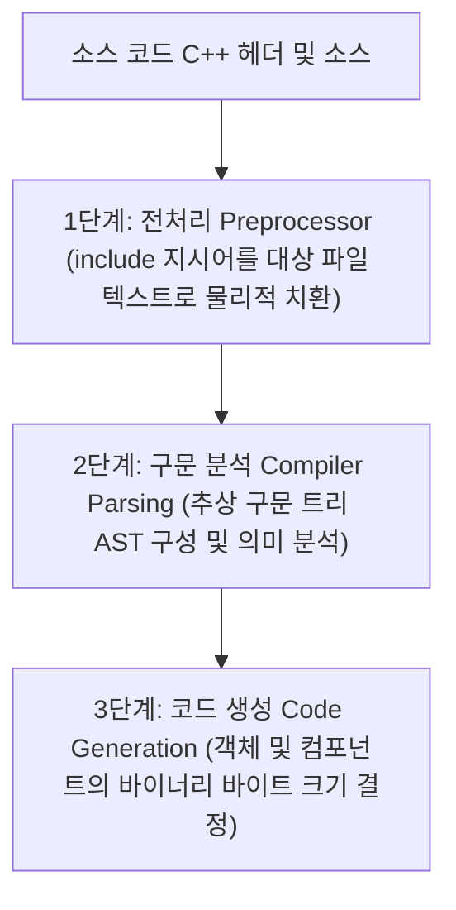

[◀ UE5 C++ 개발 대시보드로 돌아가기](./UE5.md)

# Unreal Engine C++ 헤더 include 및 전방 선언 최적화 가이드

이 문서는 `UCapsuleComponent`와 같은 컴포넌트 헤더 파일을 포함할 때, 헤더 파일(.h)과 소스 파일(.cpp) 중 어디에서 `#include`를 수행하는 것이 효율적인지, 그리고 이에 따른 컴파일러 내부의 기술적 디테일과 예제 코드를 설명합니다.

---

## 1. 헤더 include의 올바른 위치 (cpp vs h)

- **결론:** 헤더 파일(`.h`)에서는 `#include` 대신 **전방 선언(Forward Declaration)**을 사용하고, 실제 클래스의 멤버에 접근하거나 인스턴스화하는 소스 파일(`.cpp`)에서 구체적인 헤더를 `#include` 해야 합니다.

| 구분 | 헤더 파일 (.h) | 소스 파일 (.cpp) |
| :--- | :--- | :--- |
| **권장 기법** | **전방 선언 (Forward Declaration)** <br> `class UCapsuleComponent;` | **물리적 include** <br> `#include "Components/CapsuleComponent.h"` |
| **이유** | 컴포넌트의 포인터(`*`)나 참조(`&`) 변수만 선언하므로 세부 구현 스펙이 불필요함. | 멤버 변수에 접근하거나 생성자 팩토리 함수를 실행해야 하므로 실질적인 바디 크기와 메타데이터가 필요함. |

---

## 2. 전방 선언의 효율성과 의존성 관리 이유

### ① 컴파일 시간 단축 (Build Time Reduction)
헤더 파일에서 `#include`를 사용하면 해당 헤더를 포함하는 다른 모든 파일들이 그 종속성 체인에 엮이게 됩니다. 전방 선언을 사용하면 헤더 파일 간의 물리적인 의존성 체인이 끊어져 전처리된 번역 단위(Translation Unit)의 용량이 획기적으로 줄어들고 컴파일 시간이 단축됩니다.

### ② 도미노 컴파일 방지 (Rebuild Chain Prevention)
특정 컴포넌트 헤더(예: `CapsuleComponent.h`)가 변경되었을 때, 이 헤더를 직접 `#include`한 `.h` 파일이 있다면, 그 `.h` 파일을 간접 참조하는 모든 소스 파일들까지 전부 무효화(Invalidated)되어 불필요하게 재컴파일(Rebuild)됩니다. 전방 선언을 적용해 두면 구현부인 `.cpp` 파일만 다시 컴파일되고 계층 상위의 다른 모듈들은 재컴파일 대상에서 제외됩니다.

### ③ 순환 참조 오류 해결 (Circular Dependency Resolve)
클래스 A가 클래스 B의 헤더를 include하고, 클래스 B가 클래스 A의 헤더를 include할 때 발생하는 순환 참조 컴파일 에러를 원천적으로 방지합니다.

---

## 3. 컴파일 단계에서의 기술적 디테일

C++ 컴파일러가 빌드를 수행할 때, 전방 선언과 `#include`의 내부 파싱 로직 차이는 다음과 같이 전개됩니다.



### ① 전처리 단계 (Preprocessor)에서의 파일 팽창
- `#include "Header.h"`를 만나면 전처리기는 대상 헤더 파일의 모든 텍스트를 기계적으로 해당 위치에 복사-붙여넣기 합니다.
- 만약 액터 헤더가 `CapsuleComponent.h`를 인클루드하고, `CapsuleComponent.h`가 다시 `PrimitiveComponent.h`를 인클루드하는 계층 구조가 반복되면, 최종적으로 컴포넌트 포인터 변수 하나를 선언하기 위해 수만 라인에 달하는 엔진 C++ 내부 코드가 한 파일에 적재(Translation Unit의 비대화)됩니다.

### ② 구문 분석(Parsing) 및 AST 생성 부하
- 컴포넌트 헤더를 물리적으로 가져오면 컴포넌트 클래스가 선언하고 있는 멤버 변수, 가상 함수 테이블(VTable), 헬퍼 인라인 함수 등이 전부 컴파일러 파싱 큐에 등록됩니다.
- 컴파일러는 이 모든 선언을 파싱하여 메모리에 임시 구문 트리(AST)를 형성하고 중복 기입 여부 및 의미를 파악하는 언어 분석 프로세스를 매번 거쳐야 하므로 CPU 스레드 타임이 소모됩니다.

### ③ 메모리 할당(Layout) 시점과 포인터의 크기
- 컴파일러가 클래스의 메모리 배치 레이아웃을 생성할 때, 해당 클래스가 멤버 변수로 다른 객체를 지니고 있다면 그 객체의 **실제 데이터 크기(Byte Size)**를 명확히 알아야 스택이나 힙 상의 offset 값을 할당할 수 있습니다. (구체적인 헤더 include 필수)
- 그러나 객체를 포인터(`class UCapsuleComponent* MyCapsule;`) 형태로 들고 있다면 이야기가 달라집니다. 64비트 아키텍처 환경에서 모든 객체의 포인터(참조 주소) 변수의 물리적 크기는 예외 없이 **8바이트(64비트)**로 완벽하게 고정됩니다.
- 전방 선언(`class UCapsuleComponent;`)은 컴파일러에게 **"이 클래스의 실질적인 크기나 내부 구조(VTable 구조 등)는 몰라도 되지만, 포인터 변수의 주소 공간인 8바이트 공간만 미리 할당해 달라"**고 선언하는 신호입니다. 컴파일러는 세부 멤버를 분석하지 않고 8바이트 주소 공간만 떼어준 뒤 즉시 구문 분석을 다음 라인으로 넘깁니다.

---

## 4. 올바른 최적화 예제 코드

### [올바른 패턴] 헤더 파일 (`MyCharacter.h`)
```cpp
#pragma once

#include "CoreMinimal.h"
#include "GameFramework/Character.h"
// 헤더에서는 CapsuleComponent.h를 include하지 않고, 아래와 같이 class 전방 선언을 적용합니다.
#include "MyCharacter.generated.h"

UCLASS()
class MYPROJECT_API AMyCharacter : public ACharacter
{
    GENERATED_BODY()

public:
    AMyCharacter();

protected:
    // 전방 선언을 통해 컴파일러에게 8바이트 포인터 주소 크기만 예약
    UPROPERTY(VisibleAnywhere, BlueprintReadOnly, Category = "Components")
    class UCapsuleComponent* TriggerCapsule; 
    
    // 컴포넌트 클래스 전방에 'class' 키워드를 직접 붙여서도 전방 선언이 가능합니다.
};
```

### [올바른 패턴] 소스 파일 (`MyCharacter.cpp`)
```cpp
#include "MyCharacter.h"
// 실제 컴포넌트의 생성자 호출 및 내부 멤버 설정이 이루어지는 소스 파일에서 물리적 include 적용
#include "Components/CapsuleComponent.h" 

AMyCharacter::AMyCharacter()
{
    PrimaryActorTick.bCanEverTick = true;

    // CreateDefaultSubobject 및 컴포넌트 세부 설정 시, 
    // UCapsuleComponent 클래스의 완전한 구조 정보가 필요하므로 헤더 인클루드가 적용되어 있어야 작동합니다.
    TriggerCapsule = CreateDefaultSubobject<UCapsuleComponent>(TEXT("TriggerCapsuleComponent"));
    
    // 헤더 구조를 알기 때문에 멤버 변수(반지름 등)에 직접적인 값 대입이 컴파일 시점에 검증됩니다.
    TriggerCapsule->SetCapsuleRadius(40.f);
}
```
